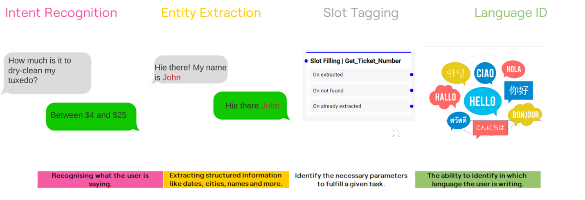

Title: O que é Anuva

# O que é Anuva?

É o primeiro recurso disponibilizado pela CITSmart de inteligência artificial. A Anuva é uma assistente virtual, um chatbot que se comunica e interage com pessoas através de mensagens de texto automatizadas.

Anuva usa inteligência artificial para realizar diálogos com usuários de forma cada vez mais aperfeiçoada em diferentes plataformas, além de interagir com usuários e capaz de integrar-se com outros sistemas para obter respostas a questionamentos, recuperando dados através de APIs.

## Funcionalidades da Anuva

Ele atende aos 5 conceitos principais das plataformas de construção de assistentes virtuais:

- **Build** : Construção de fluxos de conversação (diálogos) da assistente com possíveis interações humanas, para que ela esteja preparada para reagir e responder de forma fluida e correta;

- **Train**: Treinamento da assistente para que ela passe a considerar todos os exemplos de diálogos construídos e suas interações. A Anuva utiliza inteligência artificial para compreender o que o usuário quis dizer ou solicitar, então no momento de construção dos diálogos não é necessário escrever exatamente o que um usuário dirá a ele;

- **Code**: Possibilidade de conexão com API externas, que permitem acesso de dados necessários para as respostas;

- **Connect**: Possibilidade de integração com diversos canais de comunicação (plataformas prontas ou canais customizados). A Anuva fornece API facilmente conectável e uma conversão dentro do CITSmart para que as escolhas (sejam em botões ou não) cheguem para a Anuva como texto dando assim a tratativa correta no fluxo de diálogo. Disponibilizamos hoje integração com o smartchat da plataforma CITSmart e com o Facebook, os demais canais mais utilizados, como Twitter e Whatsapp podem ser integrados através do CITSmart;

- **Monitor**: Monitoramento que disponibiliza ao responsável pela administração do Anuva os dados para análise de como o assistente tem se comportado, perguntas mais frequentes feitas a ele, respostas mais utilizadas entre outras informações para que as os fluxos existentes possam ser aprimorados ou sejam percebidas as necessidades de construção de novos fluxos e assim, novo treinamento da assistente.

## Acessando a Anuva

Após a liberação do ambiente Anuva, acessar a instância de configuração através do link disponibilizado. (ex: https://example.anuvaassistent.com)

Neste ambiente, é possível adicionar e revisar conhecimentos para a Anuva, agendar treinamentos, acompanhar as interações realizadas pela Anuva e realizar testes de interação para validar se interações estão sendo efetivas.

## Compreensão da linguagem natural

A compreensão da linguagem natural é um ramo da IA que interpreta e entende o texto de um usuário, em seguida, converte o texto em um formato utilizável para computadores. Por exemplo, o NLU do Anuva transforma o diálogo natural do usuário em informações estruturadas que seu chatbot pode entender e usar.

As informações geradas pelas tarefas NLU são adicionadas aos metadados da mensagem diretamente (em event.nlu), prontas para serem consumidas por outros módulos e componentes.

### Principais tarefas.

Abaixo estão algumas tarefas realizadas pelo módulo NLU Tarefas de NLU

QnA: um caso de uso simples para bots é entender uma pergunta e fornecer uma resposta automaticamente. Fazer isso manualmente para todas as perguntas e respostas usando o módulo NLU e o editor de fluxo seria uma tarefa entediante, por isso recomendamos usar o módulo QnA para isso.

## Reconhecimento de Intenção

Trata-se de reconhecer o que o usuário está dizendo. Por exemplo, se o usuário perguntar: “Posso levar meu gato para voar comigo no avião?” você pode treinar o bot para entender que o usuário está perguntando sobre voar com animais de estimação e dar a resposta apropriada.

## Extração de Entidades

A extração de entidades envolve a extração de informações estruturadas de mensagens como datas, horas, cidades, nomes e muito mais. Por exemplo, se o usuário disser “Quero voar de Nova York a Montreal em 8 de março”, podemos extrair os nomes das cidades e a data. Geralmente definimos entidades na forma de padrões ou listas..

## Marcação de SLOT

A marcação de slot é necessária para identificar os parâmetros necessários para cumprir uma determinada tarefa. Se tomarmos o mesmo exemplo, queremos salvar os nomes das cidades nos parâmetros Aeroporto de e Aeroporto até e a data em um parâmetro como Data da viagem para usar esses parâmetros em nossos fluxos de trabalho.

## Identificação de Linguagem

A identificação de idioma é a capacidade de identificar em qual idioma o usuário está escrevendo. No Anuva, temos muitos módulos de idioma predefinidos, como inglês, francês, árabe, alemão e muitos mais. Você pode até adicionar seu modelo de idioma, se ainda não o tivermos, ou você pode usar um software de terceiros para fazer autotraduções.

O Anuva NLU vem com a capacidade de identificar o idioma no qual o usuário está escrevendo, se for um dos idiomas predefinidos. Mas lembre-se de que a prática recomendada para a experiência do usuário é confirmar o idioma com o usuário no início e, em seguida, manter o mesmo idioma durante a conversa

## Servidor de Linguagem

O servidor de idioma fornece informações adicionais sobre palavras, o que permite que seu chatbot entenda palavras com significados semelhantes. Ele elimina a necessidade de você ensinar ao seu chatbot sobre sinônimos e linguagem coloquial. Por padrão, seu servidor Anuva consultará um de nossos servidores de idioma para esse propósito. Você também pode escolher hospedar seu servidor se quiser manter tudo em suas instalações. Vá para a página de hospedagem para mais detalhes.

## NLU Externas

Anuva NLU é fornecido com um mecanismo nativo de NLU (Anuva Native NLU). A vantagem de usar o Anuva NLU é que ele é rápido (tanto no treinamento quanto na avaliação), seguro (não retransmite mensagens para serviços externos), previsível (você pode escrever testes de unidade e o modelo reside em seu computador ou servidor) , e livre.

Se quiser usar um provedor externo por algum motivo, você pode fazer isso usando Ganchos e chamando o provedor NLU externo por meio da API. Há um exemplo detalhado aqui.

## Recursos por provedores

|---|---|---|---|---|---|---|
|Provider|Intent|Entity|Slot|tagging|Lang|Context|Sentiment|
|Native|X|X|X|X|X||
|DialogFlow|X|X|X||X||
|Luis|X|X||||X|
|Recast|X|X||X||X|
|Rasa|X|X|||||

