Title: Guia de autorização de serviços

# Guia de autorização de serviços

Visão geral

A Keycloak apoia políticas de autorização de grãos finos e é capaz de combinar
diferentes mecanismos de controle de acesso, tais como:

-   **Controle de acesso baseado em atributos (ABAC)**

-   **Controle de acesso baseado em função (RBAC)**

-   **UBAC (User-based access control, controle de acesso baseado no usuário)**

-   **Controle de acesso baseado em contexto (CBAC)**

-   **Controle de acesso baseado em regras**

    -   Usando JavaScript

-   **Controle de acesso baseado no tempo**

-   **Suporte para ACMs (Custom Access Control Mechanisms, mecanismos de
    controle de acesso personalizados) através de uma Interface de Provedor de
    Serviços (SPI) do Provedor de Políticas**

O Keycloak é baseado em um conjunto de UIs administrativas e uma API RESTful, e
fornece os meios necessários para criar permissões para seus recursos e escopos
protegidos, associar essas permissões com políticas de autorização e aplicar
decisões de autorização em seus aplicativos e serviços.

Os servidores de recursos (aplicativos ou serviços que servem recursos
protegidos) geralmente dependem de algum tipo de informação para decidir se o
acesso deve ser concedido a um recurso protegido. Para servidores de recursos
baseados em RESTful, essas informações geralmente são obtidas a partir de um
token de segurança, geralmente enviado como um token portador em cada
solicitação ao servidor. Para aplicativos web que dependem de uma sessão para
autenticar usuários, essas informações geralmente são armazenadas em uma sessão
de usuário e recuperadas de lá para cada solicitação.

Frequentemente, os servidores de recursos só executam decisões de autorização
baseadas no controle de acesso baseado em funções (RBAC), onde as funções
concedidas ao usuário que tenta acessar recursos protegidos são verificadas em
relação às funções mapeadas para esses mesmos recursos. Embora as funções sejam
muito úteis e usadas por aplicativos, elas também têm algumas limitações:

-   Recursos e funções são fortemente acoplado e mudanças em funções (como
    adicionar, remover ou alterar um contexto de acesso) podem impactar vários
    recursos

-   Alterações em seus requisitos de segurança podem implicar alterações
    profundas no código do aplicativo para refletir essas alterações

-   Dependendo do tamanho do aplicativo, o gerenciamento de papéis pode se
    tornar difícil e propenso a erros

-   Não é o mecanismo de controle de acesso mais flexível. Os papéis não
    representam quem você é e carecem de informações contextuais. Se você
    recebeu um papel, você tem pelo menos algum acesso.

Considerando que hoje precisamos considerar ambientes heterogêneos onde os
usuários estão distribuídos em diferentes regiões, com diferentes políticas
locais, usando diferentes dispositivos e com uma alta demanda por
compartilhamento de informações, os Serviços de Autorização Keycloak podem
ajudá-lo a melhorar os recursos de autorização de seus aplicativos e serviços
fornecendo:

-   Proteção de recursos usando políticas de autorização de grãos finos e
    diferentes mecanismos de controle de acesso

-   Gerenciamento de recursos, permissões e políticas centralizados

-   Ponto de decisão da política centralizada

-   Segurança de DESCANSO com base em um conjunto de serviços de autorização
    baseados em REST

-   Fluxos de trabalho de autorização e acesso gerenciado pelo usuário

-   A infraestrutura para ajudar a evitar a replicação de código entre projetos
    (e reimplantos) e se adaptar rapidamente às mudanças em seus requisitos de
    segurança.

arquitetura

Do ponto de vista do design, os Serviços de Autorização baseiam-se em um
conjunto bem definido de padrões de autorização que fornecem esses recursos:

-   **Ponto de Administração de Políticas (PAP)**

>   Fornece um conjunto de UIs baseado no Keycloak Administration Console para
>   gerenciar servidores de recursos, recursos, escopos, permissões e políticas.
>   Parte disso também é realizada remotamente através do uso da [API de
>   Proteção](https://www.keycloak.org/docs/latest/authorization_services/index.html#_service_protection_api).

-   **Ponto de Decisão da Política (PDP)**

>   Fornece um ponto de decisão de política distribuível para onde as
>   solicitações de autorização são enviadas e as políticas são avaliadas de
>   acordo com as permissões solicitadas. Para obter mais informações, consulte
>   [Obtenção de
>   Permissões](https://www.keycloak.org/docs/latest/authorization_services/index.html#_service_obtaining_permissions).

-   **Ponto de Execução de Políticas (PEP)**

>   Fornece implementações para diferentes ambientes para realmente impor
>   decisões de autorização no lado do servidor de recursos. Keycloak fornece
>   alguns [executores de políticas
>   incorporados.](https://www.keycloak.org/docs/latest/authorization_services/index.html#_enforcer_overview)

-   **Ponto de Informação da Política (PIP)**

>   Com base no Keycloak Authentication Server, você pode obter atributos de
>   identidades e ambiente de tempo de execução durante a avaliação das
>   políticas de autorização.

O Processo de Autorização

Três processos principais definem as etapas necessárias para entender como usar
o Keycloak para permitir a autorização de grãos finos para suas aplicações:

-   **gestão de recursos**

-   **Permissão e Gerenciamento de Políticas**

-   **Aplicação da política**

gestão de recursos

**A Gestão de Recursos** envolve todas as etapas necessárias para definir o que
está sendo protegido.

Primeiro, você precisa especificar o Keycloak o que você está procurando
proteger, que geralmente representa um aplicativo web ou um conjunto de um ou
mais serviços. Para obter mais informações sobre servidores de recursos,
consulte
[Terminologia](https://www.keycloak.org/docs/latest/authorization_services/index.html#_overview_terminology).

Os servidores de recursos são gerenciados usando o Keycloak Administration
Console. Lá você pode habilitar qualquer aplicativo de cliente registrado como
um servidor de recursos e começar a gerenciar os recursos e escopos que deseja
proteger.

Um recurso pode ser uma página web, um recurso RESTFul, um arquivo em seu
sistema de arquivos, um EJB, e assim por diante. Eles podem representar um grupo
de recursos (assim como uma classe em Java) ou podem representar um recurso
único e específico.

Por exemplo, você pode ter um recurso *de Conta Bancária* que represente todas
as contas bancárias e usá-lo para definir as políticas de autorização que são
comuns a todas as contas bancárias. No entanto, você pode querer definir
políticas específicas para a Conta *Alice* (uma instância de recursos que
pertence a um cliente), onde apenas o proprietário pode acessar algumas
informações ou realizar uma operação.

Os recursos podem ser gerenciados usando o Keycloak Administration Console ou a
[API de
proteção](https://www.keycloak.org/docs/latest/authorization_services/index.html#_service_protection_api).
Neste último caso, os servidores de recursos são capazes de gerenciar seus
recursos remotamente.

Os escopos geralmente representam as ações que podem ser realizadas em um
recurso, mas não se limitam a isso. Você também pode usar escopos para
representar um ou mais atributos dentro de um recurso.

Permissão e Gerenciamento de Políticas

Depois de definir seu servidor de recursos e todos os recursos que deseja
proteger, você deve configurar permissões e políticas.

Esse processo envolve todas as etapas necessárias para definir os requisitos de
segurança e acesso que regem seus recursos.

As políticas definem as condições que devem ser satisfeitas para acessar ou
executar operações em algo (recurso ou escopo), mas não estão vinculadas ao que
estão protegendo. Eles são genéricos e podem ser reutilizados para construir
permissões ou até políticas mais complexas.

Por exemplo, para permitir o acesso a um grupo de recursos apenas para usuários
concedidos com uma função "Usuário Premium", você pode usar o RBAC (Controle de
Acesso baseado em papel).

O Keycloak fornece alguns tipos de políticas incorporadas (e seus respectivos
provedores de políticas) cobrindo os mecanismos de controle de acesso mais
comuns. Você pode até criar políticas com base em regras escritas usando
JavaScript.

Uma vez que suas políticas sejam definidas, você pode começar a definir suas
permissões. As permissões são acoplidas ao recurso que estão protegendo. Aqui
você especifica o que deseja proteger (recurso ou escopo) e as políticas que
devem estar satisfeitas em conceder ou negar permissão.

Aplicação da política

**A execução de** políticas envolve as etapas necessárias para realmente impor
decisões de autorização a um servidor de recursos. Isso é conseguido ao
habilitar um **Ponto de Execução de Políticas** ou PEP no servidor de recursos
capaz de se comunicar com o servidor de autorização, solicitar dados de
autorização e controlar o acesso a recursos protegidos com base nas decisões e
permissões devolvidas pelo servidor.

O Keycloak fornece algumas implementações incorporadas [de Policy
Enforcers](https://www.keycloak.org/docs/latest/authorization_services/index.html#_enforcer_overview)
que você pode usar para proteger seus aplicativos, dependendo da plataforma em
que estão sendo executados.

Serviços de Autorização

Os serviços de autorização consistem nos seguintes pontos finais RESTFul:

-   **Ponto final do token**

-   **Endpoint de gerenciamento de recursos**

-   **Endpoint de gerenciamento de permissões**

Cada um desses serviços fornece uma API específica abrangendo as diferentes
etapas envolvidas no processo de autorização.

Ponto final do token

Os clientes OAuth2 (como aplicativos front-end) podem obter tokens de acesso do
servidor usando o ponto final do token e usar esses mesmos tokens para acessar
recursos protegidos por um servidor de recursos (como serviços de back-end). Da
mesma forma, os Serviços de Autorização Keycloak fornecem extensões ao OAuth2
para permitir que os tokens de acesso sejam emitidos com base no processamento
de todas as políticas associadas aos recursos ou escopos que estão sendo
solicitados. Isso significa que os servidores de recursos podem impor o acesso
aos seus recursos protegidos com base nas permissões concedidas pelo servidor e
mantidas por um token de acesso. Nos Serviços de Autorização Keycloak, o token
de acesso com permissões é chamado de Token de Parte Solicitante ou RPT para
abreviar.

Para obter mais informações, consulte [Obtenção de
Permissões](https://www.keycloak.org/docs/latest/authorization_services/index.html#_service_obtaining_permissions).

API de proteção

A **API de proteção** é um conjunto de operações de fornecimento de ponto final
[compatíveis com
UMA](https://docs.kantarainitiative.org/uma/wg/oauth-uma-federated-authz-2.0-09.html)
para servidores de recursos para ajudá-los a gerenciar seus recursos, escopos,
permissões e políticas associadas a eles. Apenas servidores de recursos podem
acessar essa API, que também requer um escopo **uma_protection.**

As operações fornecidas pela API de Proteção podem ser organizadas em dois
grupos principais:

-   **gestão de recursos**

    -   Criar recursos

    -   Excluir recursos

    -   Encontrar por Id

    -   consulta

-   **Gerenciamento de permissões**

    -   Emissão de Bilhetes de Permissão

|   | Por padrão, o gerenciamento remoto de recursos está ativado. Você pode alterar isso usando o Keycloak Administration Console e apenas permitir o gerenciamento de recursos através do console. |
|---|------------------------------------------------------------------------------------------------------------------------------------------------------------------------------------------------|

Ao utilizar o protocolo UMA, a emissão de Tickets de Permissão pela API de
Proteção é uma parte importante de todo o processo de autorização. Conforme
descrito em uma seção subsequente, eles representam as permissões solicitadas
pelo cliente e que são enviadas ao servidor para obter um token final com todas
as permissões concedidas durante a avaliação das permissões e políticas
associadas aos recursos e escopos solicitados.

Para obter mais informações, consulte [API de
proteção](https://www.keycloak.org/docs/latest/authorization_services/index.html#_service_protection_api).

terminologia

Antes de ir mais longe, é importante entender esses termos e conceitos
introduzidos pelos Serviços de Autorização Keycloak.

Servidor de recursos

De acordo com a terminologia OAuth2, um servidor de recursos é o servidor que
hospeda os recursos protegidos e capaz de aceitar e responder a solicitações de
recursos protegidos.

Os servidores de recursos geralmente dependem de algum tipo de informação para
decidir se o acesso a um recurso protegido deve ser concedido. Para servidores
de recursos baseados em RESTful, essas informações geralmente são transportadas
em um token de segurança, normalmente enviado como um token portador, juntamente
com cada solicitação ao servidor. Aplicativos web que dependem de uma sessão
para autenticar usuários geralmente armazenam essas informações na sessão do
usuário e as recuperam de lá para cada solicitação.

No Keycloak, qualquer aplicativo confidencial de clientes pode atuar como um
servidor de recursos. Os recursos desse cliente e seus respectivos escopos são
protegidos e regidos por um conjunto de políticas de autorização.

recurso

Um recurso faz parte dos ativos de uma aplicação e da organização. Pode ser um
conjunto de um ou mais pontos finais, um recurso clássico da Web, como uma
página HTML, e assim por diante. Na terminologia da política de autorização, um
recurso é o *objeto* que está sendo protegido.

Cada recurso tem um identificador único que pode representar um único recurso ou
um conjunto de recursos. Por exemplo, você pode gerenciar um *Recurso de Conta
Bancária* que represente e defina um conjunto de políticas de autorização para
todas as contas bancárias. Mas você também pode ter um recurso diferente chamado
*Alice's Banking Account*, que representa um único recurso de propriedade de um
únicocliente, que pode ter seu próprio conjunto de políticas de autorização.

âmbito

O escopo de um recurso é uma extensão limitada de acesso que é possível executar
em um recurso. Na terminologia da política de autorização, um escopo é um dos
*verbos* potencialmente muitos que podem logicamente aplicar-se a um recurso.

Geralmente indica o que pode ser feito com um determinado recurso. Exemplos de
escopos são visualizar, editar, excluir e assim por diante. No entanto, o escopo
também pode estar relacionado a informações específicas fornecidas por um
recurso. Neste caso, você pode ter um recurso de projeto e um escopo de custo,
onde o escopo de custos é usado para definir políticas e permissões específicas
para os usuários acessarem o custo de um projeto.

permissão

Considere esta permissão simples e muito comum:

Uma permissão associa o objeto a ser protegido com as políticas que devem ser
avaliadas para determinar se o acesso é concedido.

-   **X** PODE FAZER **Y** NO RECURSO **Z**

    -   onde...

        -   **X** representa um ou mais usuários, funções ou grupos, ou uma
            combinação deles. Você também pode usar reivindicações e contexto
            aqui.

        -   **Y** representa uma ação a ser realizada, por exemplo, escrever,
            visualizar e assim por diante.

        -   **Z** representa um recurso protegido, por exemplo, "/contas".

O Keycloak fornece uma plataforma rica para construir uma série de estratégias
de permissão que vão desde permissões dinâmicas simples a muito complexas
baseadas em regras. Ele fornece flexibilidade e ajuda a:

-   Reduza os custos de refatoração de códigos e gerenciamento de permissões

-   Apoie um modelo de segurança mais flexível, ajudando você a se adaptar
    facilmente às mudanças em seus requisitos de segurança

-   Faça alterações no tempo de execução; os aplicativos estão apenas
    preocupados com os recursos e escopos que estão sendo protegidos e não como
    eles são protegidos.

política

Uma política define as condições que devem ser satisfeitas para conceder acesso
a um objeto. Ao contrário das permissões, você não especifica o objeto que está
sendo protegido, mas sim as condições que devem ser satisfeitas para o acesso a
um determinado objeto (por exemplo, recurso, escopo ou ambos). As políticas
estão fortemente relacionadas aos diferentes mecanismos de controle de acesso
(ACMs) que você pode usar para proteger seus recursos. Com as políticas, você
pode implementar estratégias para o controle de acesso baseado em atributos
(ABAC), controle de acesso baseado em papel (RBAC), controle de acesso baseado
em contexto ou qualquer combinação delas.

Keycloak aproveita o conceito de políticas e como você as define fornecendo o
conceito de políticas agregadas, onde você pode construir uma "política de
políticas" e ainda controlar o comportamento da avaliação. Em vez de escrever
uma grande política com todas as condições que devem ser satisfeitas para o
acesso a um determinado recurso, a implementação de políticas nos Serviços de
Autorização keycloak segue a técnica de divisão e conquista. Ou seja, você pode
criar políticas individuais, depois reutilizá-las com diferentes permissões e
construir políticas mais complexas combinando políticas individuais.

Provedor de Políticas

Os provedores de políticas são implementações de tipos de políticas específicas.
O Keycloak fornece políticas incorporadas, apoiadas por seus provedores de
políticas correspondentes, e você pode criar seus próprios tipos de políticas
para apoiar seus requisitos específicos.

O Keycloak fornece um SPI (Service Provider Interface) que você pode usar para
conectar suas próprias implementações de provedor de políticas.

Bilhete de permissão

Um ticket de permissão é um tipo especial de token definido pela especificação
UM (User-Managed Access, acesso gerenciado pelo usuário) que fornece uma
estrutura opaca cujo formulário é determinado pelo servidor de autorização. Essa
estrutura representa os recursos e/ou escopos solicitados por um cliente, o
contexto de acesso, bem como as políticas que devem ser aplicadas a uma
solicitação de dados de autorização (solicitando token partidário [RPT]).

Na UMA, os bilhetes de permissão são cruciais para apoiar o compartilhamento de
pessoa para pessoa e também de pessoa para organização. O uso de tickets de
permissão para fluxos de trabalho de autorização permite uma série de cenários,
do simples ao complexo, onde proprietários de recursos e servidores de recursos
têm controle completo sobre seus recursos com base em políticas de grãos finos
que regem o acesso a esses recursos.

No fluxo de trabalho UMA, os bilhetes de permissão são emitidos pelo servidor de
autorização para um servidor de recursos, que devolve o bilhete de permissão ao
cliente que tenta acessar um recurso protegido. Uma vez que o cliente receba o
bilhete, ele pode fazer uma solicitação de um RPT (um token final segurando
dados de autorização) enviando o bilhete de volta para o servidor de
autorização.

Para obter mais informações sobre os bilhetes de permissão, consulte [o Acesso
Gerenciado pelo
Usuário](https://www.keycloak.org/docs/latest/authorization_services/index.html#_service_user_managed_access)
e a especificação
[UMA.](https://docs.kantarainitiative.org/uma/wg/oauth-uma-grant-2.0-09.html)

Começando

Antes de usar este tutorial, você precisa concluir a instalação do Keycloak e
criar o usuário administrador inicial, como mostrado no tutorial [Do Guia de
Início.](https://www.keycloak.org/docs/latest/getting_started/) Há uma ressalva
nisso. Você tem que executar uma instância wildfly separada na mesma máquina que
o Keycloak Server. Esta instância separada executará o aplicativo Java Servlet.
Por causa disso, você terá que executar o Keycloak sob uma porta diferente para
que não haja conflitos portuários ao funcionar na mesma máquina. Use a
propriedade do sistema jboss.socket.binding.port-offset na linha de comando. O
valor desta propriedade é um número que será adicionado ao valor base de cada
porta aberta pelo Keycloak Server.

Para inicializar o Keycloak Server:

Linux/Unix

\$ .../bin/autônomo.sh -Djboss.socket.binding.port-offset=100

Windows

\> ...\\bin\\autônomo.bat -Djboss.socket.binding.port-offset=100

Para obter mais detalhes sobre como instalar e configurar um WildFly, siga os
passos no tutorial [do Guia de Aplicativos e Serviços de
Proteção.](https://www.keycloak.org/docs/latest/securing_apps/)

Depois de instalar e inicializar ambos os servidores, você deve ser capaz de
acessar o Keycloak Admin Console em <http://localhost:8180/auth/admin/> e também
a instância WildFly em [http://localhost:8080](http://localhost:8080/).

Garantindo um aplicativo Servlet

O objetivo deste guia de início é colocá-lo em funcionamento o mais rápido
possível para que você possa experimentar e testar vários recursos de
autorização fornecidos pela Keycloak. Este passeio rápido depende fortemente das
configurações padrão de banco de dados e servidor e não cobre opções complexas
de implantação. Para obter mais informações sobre recursos ou opções de
configuração, consulte as seções apropriadas nesta documentação.

Este guia explica os principais conceitos sobre os Serviços de Autorização
Keycloak:

-   Permitindo autorização de grãos finos para uma aplicação de cliente

-   Configurar um aplicativo cliente para ser um servidor de recursos, com
    recursos protegidos

-   Definição de permissões e políticas de autorização para governar o acesso a
    recursos protegidos

-   Habilitando a aplicação da política em seus aplicativos.

Criando um Reino e um Usuário

O primeiro passo neste tutorial é criar um reino e um usuário nesse reino.
Então, dentro do reino, criaremos um único aplicativo cliente, que se torna um
[servidor de
recursos](https://www.keycloak.org/docs/latest/authorization_services/index.html#_overview_terminology)
para o qual você precisa habilitar serviços de autorização.

Para criar um reino e um usuário completar as seguintes etapas:

1.  Crie um reino com um nome **hello-world-authz**. Uma vez criada, uma página
    semelhante à seguinte é exibida:

>   Reino olá-mundo-authz

>   Reino olá-mundo-authz

1.  Crie um usuário para o seu reino recém-criado. Clique **em Usuários**. A
    página da lista de usuários é aberta.

2.  No lado direito da lista de usuários vazia, clique em **Adicionar usuário**.

3.  Para criar um novo usuário, complete os campos **de Nome de Usuário, E-mail,
    Primeiro Nome**e **Sobrenome.** Clique no **interruptor ativado pelo
    usuário** para **Ativar**e, em seguida, clique em **Salvar**.

>   Adicionar usuário

>   Adicionar usuário

1.  Defina uma senha para o usuário clicando na guia **Credenciais.**

>   Definir senha do usuário

>   Definir senha do usuário

1.  Complete os campos **de confirmação de nova senha** e **senha** com uma
    senha e clique no interruptor **temporário** para **OFF**.

2.  Clique **em Definir senha** para definir a senha do usuário.

Habilitação de Serviços de Autorização

Você pode habilitar serviços de autorização em um aplicativo cliente existente
configurado para usar o Protocolo de Conexão OpenID. Você também pode criar um
novo cliente.

Para criar um novo cliente, complete as seguintes etapas:

1.  Clique em **Clientes** para começar a criar um novo aplicativo de cliente e
    preencher os campos de **ID do**cliente, **Protocolo do Cliente**e **URL
    Raiz.**

>   Criar aplicativo de cliente

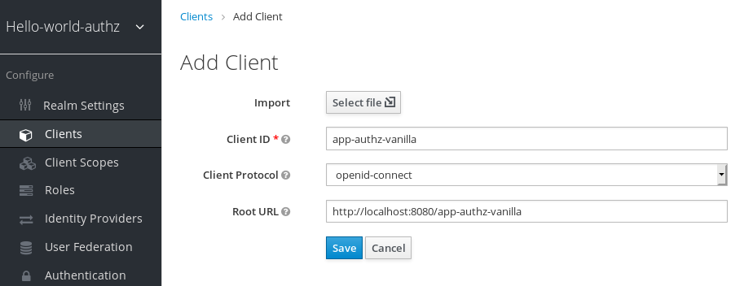

>   Criar aplicativo de cliente

1.  Clique **em Salvar**. A página Detalhes do cliente é exibida.

2.  Na página Detalhes do cliente, selecione **confidencial** no campo **Tipo de
    acesso,** altere o interruptor **habilitado** para autorização para **ON**e,
    em seguida, clique em **Salvar**. Uma nova guia **Autorização** é exibida
    para o cliente.

>   Detalhes do cliente

>   Detalhes do cliente

1.  Clique na guia **Autorização** e uma página de Configurações de Autorização
    semelhante à seguinte é exibida:

>   Configurações de autorização

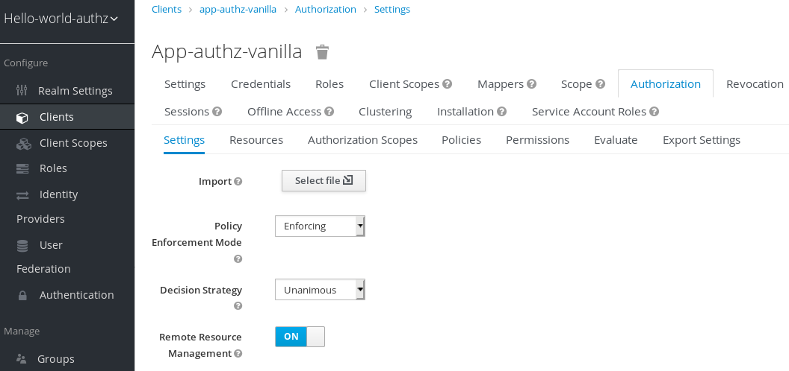

>   Configurações de autorização

Quando você habilita serviços de autorização para um aplicativo cliente, o
Keycloak cria automaticamente várias [configurações
padrão](https://www.keycloak.org/docs/latest/authorization_services/index.html#_resource_server_default_config)
para a configuração de autorização do cliente.

Para obter mais informações sobre a configuração da autorização, consulte
[Enableing Authorization
Services](https://www.keycloak.org/docs/latest/authorization_services/index.html#_resource_server_enable_authorization).

Construa, implante e teste sua aplicação

Agora que o servidor de recursos **app-authz-baunilha** (ou cliente) está
devidamente configurado e os serviços de autorização estão habilitados, ele pode
ser implantado no servidor.

O projeto e o código para o aplicativo que você vai implantar está disponível no
[Repositório Keycloak
Quickstarts](https://github.com/keycloak/keycloak-quickstarts). Você precisará
do seguinte instalado em sua máquina e disponível em seu PATH antes de poder
continuar:

-   Java JDK 8

-   Apache Maven 3.1.1 ou superior

-   Git

Você pode obter o código clonando o repositório em
<https://github.com/keycloak/keycloak-quickstarts>. As quickstarts são
projetadas para trabalhar com a versão keycloak mais recente.

Siga estas etapas para baixar o código.

Projeto Clone

\$ git clone https://github.com/keycloak/keycloak-quickstarts

O aplicativo que estamos prestes a construir e implantar está localizado em

\$ cd keycloak-quickstarts/app-authz-jee-baunilha

Obtenção da configuração do adaptador

Primeiro, você deve obter a configuração do adaptador antes de construir e
implantar o aplicativo.

Para obter a configuração do adaptador do Console de Administração Keycloak,
complete as seguintes etapas.

1.  Clique **em Clientes**. Na lista de clientes, clique no aplicativo do
    cliente **app-authz-baunilha.** A página Detalhes do Cliente é aberta.

>   Detalhes do cliente

>   Detalhes do cliente

1.  Clique na guia **Instalação.** Na lista suspensa de opção de formato,
    selecione **Keycloak OIDC JSON**. A configuração do adaptador é exibida no
    formato JSON. Clique em **Baixar**.

>   Configuração do adaptador

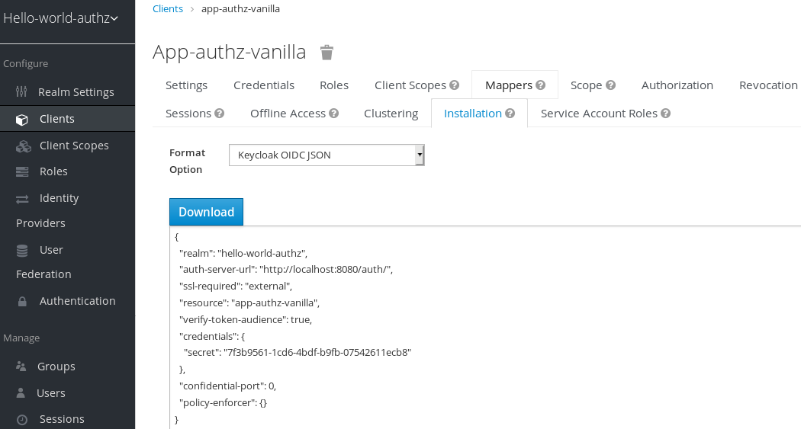

>   Configuração do adaptador

1.  Mova o arquivo keycloak.json para o diretório app-authz-jee-vanilla/config.

2.  (opcional) Por padrão, o executor de políticas responde com um código de
    status de 403 quando o usuário não tem permissão para acessar recursos
    protegidos no servidor de recursos. No entanto, você também pode especificar
    uma URL de redirecionamento para usuários não autorizados. Para especificar
    uma URL de redirecionamento, edite o arquivo **keycloak.json** atualizado na
    etapa 3 e substitua a configuração do executor de diretiva com o seguinte:

3.  "policy-enforcer":{

4.  "on-deny-redirect-to" : "/app-authz-vanilla/error.jsp"

>   }

>   Essa alteração especifica ao executor de políticas para redirecionar os
>   usuários para uma página /app-authz-vanilla/error.jsp se um usuário não
>   tiver as permissões necessárias para acessar um recurso protegido, em vez de
>   uma mensagem não autorizada 403 não autorizada.

Construindo e implantando o aplicativo

Para construir e implantar o aplicativo execute o seguinte comando:

\$ cd keycloak-quickstarts/app-authz-jee-baunilha

\$ mvn pacote limpo wildfly:implantar

Testando a Aplicação

Se o seu aplicativo foi implantado com sucesso, você pode acessá-lo [em
http://localhost:8080/app-authz-vanilla](http://localhost:8080/app-authz-vanilla).
A página de login do Keycloak é aberta.

Página de login

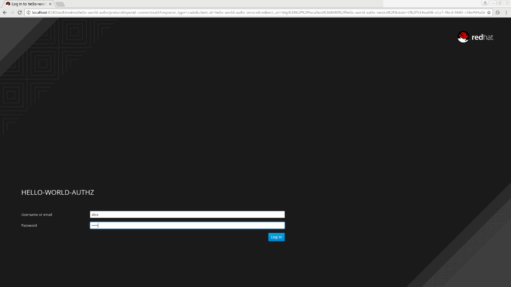

Faça login como **alice** usando a senha especificada para esse usuário. Após a
autenticação, a seguinte página é exibida:

Olá World Authz Página Principal

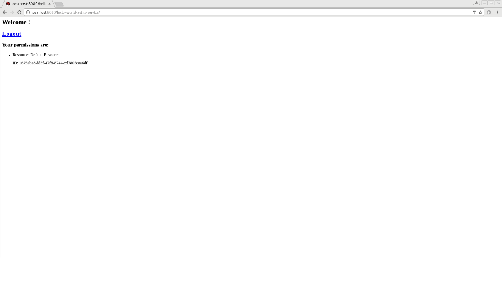

As [configurações padrão
definidas](https://www.keycloak.org/docs/latest/authorization_services/index.html#_resource_server_default_config)
pelo Keycloak quando você habilita serviços de autorização para um aplicativo
cliente fornecem uma política simples que sempre concede acesso aos recursos
protegidos por essa política.

Você pode começar alterando as permissões e políticas padrão e testar como seu
aplicativo responde, ou até mesmo criar novas políticas usando os [diferentes
tipos](https://www.keycloak.org/docs/latest/authorization_services/index.html#_policy_overview)
de políticas fornecidos pelo Keycloak.

Há muitas coisas que você pode fazer agora para testar esta aplicação. Por
exemplo, você pode alterar a política padrão clicando na guia Autorização para o
cliente e, em seguida, na guia Políticas e, em seguida, clique em Política
padrão na lista para permitir que você altere-a da seguinte forma:

*O valor padrão é \$evaluation.grant(),*

*vamos ver o que acontece quando mudamos para \$evaluation.negar()*

\$evaluation.deny();

Agora, saia do aplicativo de demonstração e faça login novamente. Você não pode
mais acessar o aplicativo.

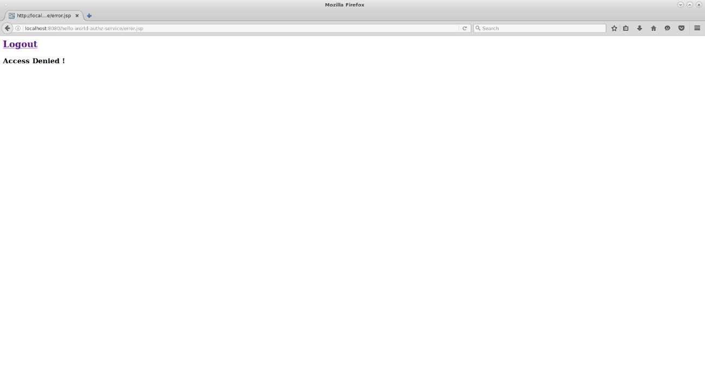

Vamos corrigir isso agora, mas em vez de alterar o código de política padrão,
vamos alterar a lógica para negativa usando a lista suspensa abaixo da área de
texto de código de política. Isso ressuma o acesso ao aplicativo, pois estamos
negando o resultado dessa política, que é por padrão negar todos os pedidos de
acesso. Novamente, antes de testar essa alteração, certifique-se de fazer login
e fazer login novamente.

Próximos passos

Há coisas adicionais que você pode fazer, tais como:

-   Crie um escopo, defina uma política e permissão para ele e teste-o no lado
    do aplicativo. O usuário pode realizar uma ação (ou qualquer outra coisa
    representada pelo escopo que você criou)?

-   Crie diferentes tipos de políticas, como [baseadas em
    JavaScript,](https://www.keycloak.org/docs/latest/authorization_services/index.html#_policy_js)e
    associe essas políticas à Permissão padrão.

-   Aplique várias políticas à Permissão Padrão e teste o comportamento. Por
    exemplo, combine várias políticas e mude a Estratégia de Decisão de acordo.

-   Para obter mais informações sobre como visualizar e testar permissões dentro
    de seu aplicativo, consulte [Obtenção do Contexto de
    Autorização](https://www.keycloak.org/docs/latest/authorization_services/index.html#_enforcer_authorization_context).

Autorização Quickstarts

Além do **quickstart app-authz-jee-vanilla** que foi usado como um aplicativo de
amostra na seção anterior, o [Repositório Keycloak
Quickstarts](https://github.com/keycloak/keycloak-quickstarts) contém outros
aplicativos que fazem uso dos serviços de autorização descritos nesta
documentação.

As quickstarts de autorização foram projetadas para que os serviços de
autorização sejam exibidos em diferentes cenários e utilizando diferentes
tecnologias e integrações. Não se destina a ser um conjunto abrangente de todos
os possíveis casos de uso envolvendo autorização, mas eles devem fornecer um
ponto de partida para os usuários interessados em entender como os serviços de
autorização podem ser usados em seus próprios aplicativos.

Cada quickstart tem um arquivo README com instruções sobre como construir,
implantar e testar o aplicativo de amostra. A tabela a seguir fornece uma breve
descrição das partidas de autorização disponíveis:

| Mesa 1. Autorização Quickstarts                                                                                     |                                                                                                                                                                                                                |
|---------------------------------------------------------------------------------------------------------------------|----------------------------------------------------------------------------------------------------------------------------------------------------------------------------------------------------------------|
| **nome**                                                                                                            | **descrição**                                                                                                                                                                                                  |
| [app-authz-jee-servlet](https://github.com/keycloak/keycloak-quickstarts/tree/latest/app-authz-jee-servlet)         | Demonstra como habilitar a autorização de grãos finos para um aplicativo Java EE, a fim de proteger recursos específicos e construir um menu dinâmico com base nas permissões obtidas de um Servidor Keycloak. |
| [app-authz-jee-baunilha](https://github.com/keycloak/keycloak-quickstarts/tree/latest/app-authz-jee-vanilla)        | Demonstra como habilitar a autorização de grãos finos para um aplicativo Java EE e usar as configurações de autorização padrão para proteger todos os recursos da aplicação.                                   |
| [app-authz-rest-springboot](https://github.com/keycloak/keycloak-quickstarts/tree/latest/app-authz-rest-springboot) | Demonstra como proteger um serviço SpringBoot REST usando os Serviços de Autorização Keycloak.                                                                                                                 |
| [app-authz-springboot](https://github.com/keycloak/keycloak-quickstarts/tree/latest/app-authz-springboot)           | Demonstra como escrever um aplicativo SpringBoot Web onde aspectos de autenticação e autorização são gerenciados pelo Keycloak.                                                                                |
| [app-authz-uma-photoz](https://github.com/keycloak/keycloak-quickstarts/tree/latest/app-authz-uma-photoz)           | Um aplicativo simples baseado em HTML5+AngularJS+JAX-RS que demonstra como ativar o acesso gerenciado pelo usuário ao seu aplicativo e permitir que os usuários gerenciem permissões para seus recursos.       |

Gerenciamento de servidores de recursos

De acordo com a especificação OAuth2, um servidor de recursos é um servidor que
hospeda os recursos protegidos e capaz de aceitar e responder a solicitações de
recursos protegidos.

Em Keycloak, os servidores de recursos são fornecidos com uma rica plataforma
para permitir a autorização de grãos finos para seus recursos protegidos, onde
as decisões de autorização podem ser tomadas com base em diferentes mecanismos
de controle de acesso.

Qualquer aplicativo do cliente pode ser configurado para suportar permissões de
grãos finos. Ao fazer isso, você está conceitualmente transformando o aplicativo
cliente em um servidor de recursos.

Criando um aplicativo para clientes

O primeiro passo para ativar os Serviços de Autorização keycloak é criar o
aplicativo cliente que você deseja transformar em um servidor de recursos.

Para criar um aplicativo cliente, complete as seguintes etapas:

1.  Clique **em Clientes**.

>   Clientes

>   Clientes

1.  Nesta página, clique em **Criar**.

>   Criar cliente

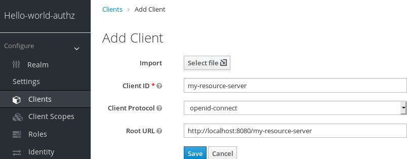

>   Criar cliente

1.  Digite a ID do cliente. Por exemplo, *meu servidor de recursos*.

2.  Digite a URL Root para o seu aplicativo. Por exemplo:

>   http://\${host}:\${port}/my-resource-server

1.  Clique **em Salvar**. O cliente é criado e a página Configurações do cliente
    é aberta. Uma página semelhante à seguinte é exibida:

>   Configurações do cliente

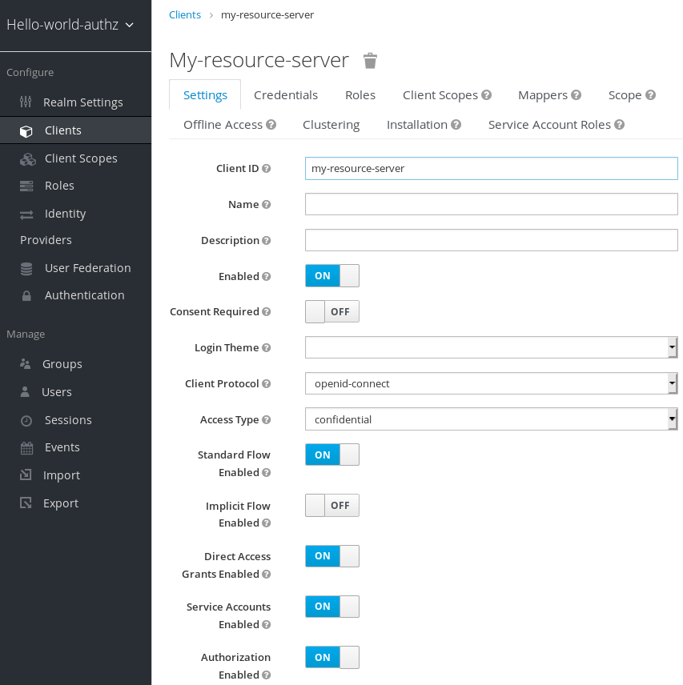

>   Configurações do cliente

Habilitação de Serviços de Autorização

Para transformar seu aplicativo cliente OIDC em um servidor de recursos e
habilitar uma autorização de grãos finos, selecione **o tipo de acesso
confidencial** e clique no switch **habilitado** para autorização para **ON** e
clique em **Salvar**.

Habilitação de Serviços de Autorização

Uma nova guia Autorização é exibida para este cliente. Clique na guia
**Autorização** e uma página semelhante à seguinte é exibida:

Configurações do servidor de recursos

A guia Autorização contém subsusas adicionais que cobrem as diferentes etapas
que você deve seguir para realmente proteger os recursos do seu aplicativo. Cada
guia é coberta separadamente por um tópico específico nesta documentação. Mas
aqui está uma rápida descrição sobre cada um:

-   **Configurações**

>   Configurações gerais para o servidor de recursos. Para obter mais detalhes
>   sobre esta página, consulte a seção [Configurações do servidor de
>   recursos.](https://www.keycloak.org/docs/latest/authorization_services/index.html#resource_server_settings)

-   **recurso**

>   A partir desta página, você pode gerenciar [os
>   recursos](https://www.keycloak.org/docs/latest/authorization_services/index.html#_resource_overview)do
>   seu aplicativo.

-   **Escopos de autorização**

>   A partir desta página, você pode gerenciar
>   [escopos](https://www.keycloak.org/docs/latest/authorization_services/index.html#_resource_overview).

-   **Políticas**

>   A partir desta página, você pode gerenciar [políticas de
>   autorização](https://www.keycloak.org/docs/latest/authorization_services/index.html#_policy_overview)
>   e definir as condições que devem ser cumpridas para conceder uma permissão.

-   **Permissões**

>   A partir desta página, você pode gerenciar as
>   [permissões](https://www.keycloak.org/docs/latest/authorization_services/index.html#_permission_overview)
>   para seus recursos e escopos protegidos, vinculando-os às políticas criadas.

-   **avaliar**

>   A partir desta página, você pode [simular solicitações de
>   autorização](https://www.keycloak.org/docs/latest/authorization_services/index.html#_policy_evaluation_overview)
>   e visualizar o resultado da avaliação das permissões e políticas de
>   autorização que você definiu.

-   **Configurações de exportação**

>   A partir desta página, você pode
>   [exportar](https://www.keycloak.org/docs/latest/authorization_services/index.html#_resource_server_import_config)
>   as configurações de autorização para um arquivo JSON.

Configurações do servidor de recursos

Na página Configurações do servidor de recursos, você pode configurar o modo de
execução de diretivas, permitir o gerenciamento remoto de recursos e exportar as
configurações de configuração de autorização.

-   **Modo de execução de políticas**

>   Especifica como as políticas são aplicadas ao processar solicitações de
>   autorização enviadas ao servidor.

-   **Aplicação**

>   (modo padrão) Os pedidos são negados por padrão mesmo quando não há uma
>   política associada a um determinado recurso.

-   **permissivo**

>   As solicitações são permitidas mesmo quando não há uma política associada a
>   um determinado recurso.

-   **desactivado**

>   Desativa a avaliação de todas as políticas e permite o acesso a todos os
>   recursos.

-   **Estratégia de Decisão**

>   Essas configurações alteram a forma como o mecanismo de avaliação da
>   política decide se um recurso ou escopo deve ou não ser concedido com base
>   no resultado de todas as permissões avaliadas. Afirmativa significa que pelo
>   menos uma permissão deve avaliar uma decisão positiva para conceder acesso a
>   um recurso e seus escopos. Unânime significa que todas as permissões devem
>   avaliar uma decisão positiva para que a decisão final também seja positiva.
>   Como exemplo, se duas permissões para um mesmo recurso ou escopo estiverem
>   em conflito (uma delas está concedendo acesso e a outra está negando
>   acesso), a permissão para o recurso ou escopo será concedida se a estratégia
>   escolhida for afirmativa. Caso contrário, uma única negação de qualquer
>   permissão também negará acesso ao recurso ou escopo.

-   **Gerenciamento remoto de recursos**

>   Especifica se os recursos podem ser gerenciados remotamente pelo servidor de
>   recursos. Se falsos, os recursos só podem ser gerenciados a partir do
>   console de administração.

Configuração padrão

Quando você cria um servidor de recursos, o Keycloak cria uma configuração
padrão para o servidor de recursos recém-criado.

A configuração padrão consiste em:

-   Um recurso protegido padrão representando todos os recursos em sua
    aplicação.

-   Uma política que sempre concede acesso aos recursos protegidos por essa
    política.

-   Uma permissão que rege o acesso a todos os recursos com base na política
    padrão.

O recurso protegido padrão é referido como o **recurso padrão** e você pode
visualizá-lo se navegar até a guia **Recursos.**

Recurso Padrão

Este recurso define um Tipo, ou seja, urn:my-resource-server:resources:default e
a URI /\*. Aqui, o campo URI define um padrão curinga que indica ao Keycloak que
esse recurso representa todos os caminhos em sua aplicação. Em outras palavras,
ao permitir a [aplicação da
política](https://www.keycloak.org/docs/latest/authorization_services/index.html#_enforcer_overview)
para o seu aplicativo, todas as permissões associadas ao recurso serão
examinadas antes de conceder acesso.

O Tipo mencionado anteriormente define um valor que pode ser usado para criar
[permissões de recursos
digitado](https://www.keycloak.org/docs/latest/authorization_services/index.html#_permission_typed_resource)
que devem ser aplicadas ao recurso padrão ou a qualquer outro recurso que você
crie usando o mesmo tipo.

A política padrão é referida como a **única da política de reino** e você pode
visualizá-la se navegar até a guia **Políticas.**

Política padrão

Esta política é uma [política baseada em
JavaScript](https://www.keycloak.org/docs/latest/authorization_services/index.html#_policy_js)
que define uma condição que sempre concede acesso aos recursos protegidos por
essa política. Se você clicar nesta política, você pode ver que ela define uma
regra da seguinte forma:

*por padrão, concede qualquer permissão associada a esta política*

\$evaluation.grant();

Por fim, a permissão padrão é referida como a **permissão padrão** e você pode
visualizá-la se navegar até a guia **Permissões.**

Permissão padrão

Esta permissão é uma [permissão baseada em
recursos,](https://www.keycloak.org/docs/latest/authorization_services/index.html#_permission_create_resource)definindo
um conjunto de uma ou mais políticas que são aplicadas a todos os recursos com
um determinado tipo.

Alterando a configuração padrão

Você pode alterar a configuração padrão removendo as definições padrão de
recursos, diretivas ou permissões e criando as suas próprias.

O recurso padrão é criado com um **URI** que mapeia qualquer recurso ou caminho
em seu aplicativo usando um padrão **/**\*. Antes de criar seus próprios
recursos, permissões e políticas, certifique-se de que a configuração padrão não
conflita com suas próprias configurações.

|   | A configuração padrão define um recurso que mapeia todos os caminhos do seu aplicativo. Se você estiver prestes a escrever permissões para seus próprios recursos, certifique-se de remover o **Recurso Padrão** ou alterar seus campos URIS para um caminho mais específico em seu aplicativo. Caso contrário, a política associada ao recurso padrão (que por padrão sempre concede acesso) permitirá que a Keycloak conceda acesso a qualquer recurso protegido. |
|---|---------------------------------------------------------------------------------------------------------------------------------------------------------------------------------------------------------------------------------------------------------------------------------------------------------------------------------------------------------------------------------------------------------------------------------------------------------------------|

Configuração de autorização de exportação e importação

As configurações de configuração de um servidor de recursos (ou cliente) podem
ser exportadas e baixadas. Você também pode importar um arquivo de configuração
existente para um servidor de recursos. Importar e exportar um arquivo de
configuração é útil quando você deseja criar uma configuração inicial para um
servidor de recursos ou atualizar uma configuração existente. O arquivo de
configuração contém definições para:

-   Recursos e escopos protegidos

-   Políticas

-   Permissões

Exportação de um arquivo de configuração

Para exportar um arquivo de configuração, complete as seguintes etapas:

1.  Navegue até a página **Configurações do servidor de recursos.**

2.  Clique na guia **Configurações de exportação.**

3.  Nesta página, clique em **Exportar**.

>   Configurações de exportação

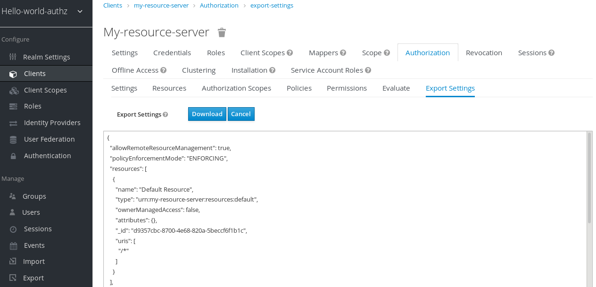

>   Configurações de exportação

O arquivo de configuração é exportado em formato JSON e exibido em uma área de
texto, a partir da qual você pode copiar e colar. Você também pode clicar **em
Baixar** para baixar o arquivo de configuração e salvá-lo.

Importação de um arquivo de configuração

Para importar um arquivo de configuração, complete as seguintes etapas:

1.  Navegue até a página **Configurações do servidor de recursos.**

>   Configurações de importação

>   Configurações de importação

Para importar um arquivo de configuração para um servidor de recursos, clique em
**Selecionar arquivo** para selecionar um arquivo contendo a configuração que
deseja importar.

Gerenciamento de recursos e escopos

A gestão de recursos é simples e genérica. Depois de criar um servidor de
recursos, você pode começar a criar os recursos e escopos que deseja proteger.
Os recursos e escopos podem ser gerenciados navegando nas guias **De Recursos**
e **Escopos de Autorização,** respectivamente.

Visualização de recursos

Na página **Recursos,** você vê uma lista dos recursos associados a um servidor
de recursos.

Recursos

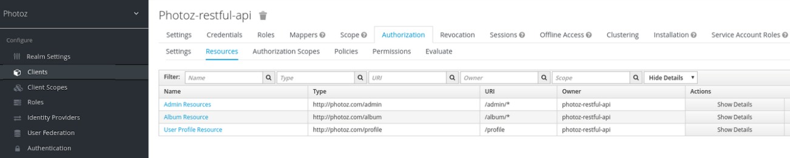

A lista de recursos fornece informações sobre os recursos protegidos, tais como:

-   tipo

-   Uris

-   proprietário

-   Escopos associados, se houver

-   Permissões associadas

A partir desta lista, você também pode criar diretamente uma permissão clicando
em **Criar Permissão** para o recurso para o qual deseja criar a permissão.

|   | Antes de criar permissões para seus recursos, certifique-se de que você já definiu as políticas que deseja associar com a permissão. |
|---|--------------------------------------------------------------------------------------------------------------------------------------|

Criando Recursos

Criar um recurso é simples e genérico. Sua principal preocupação é a
granularidade dos recursos que você cria. Em outras palavras, recursos podem ser
criados para representar um conjunto de um ou mais recursos e a maneira como
você os define é crucial para gerenciar permissões.

Para criar um novo recurso, clique em **Criar** no canto superior direito da
listagem de recursos.

Adicionar recursos

No Keycloak, um recurso define um pequeno conjunto de informações que é comum a
diferentes tipos de recursos, tais como:

-   **nome**

>   Uma sequência humana legível e única descrevendo esse recurso.

-   **tipo**

>   Uma sequência identificando exclusivamente o tipo de um conjunto de um ou
>   mais recursos. O tipo é uma *sequência* usada para agrupar diferentes
>   instâncias de recursos. Por exemplo, o tipo padrão do recurso padrão criado
>   automaticamente é urn:resource-server-name:resources:default

-   **Uris**

>   URIS que fornece os locais/endereços para o recurso. Para os recursos HTTP,
>   o URIS geralmente são os caminhos relativos usados para atender a esses
>   recursos.

-   **Escopos**

>   Um ou mais escopos para associar-se ao recurso.

Atributos de recursos

Os recursos podem ter atributos associados a eles. Esses atributos podem ser
usados para fornecer informações adicionais sobre um recurso e para fornecer
informações adicionais às políticas ao avaliar permissões associadas a um
recurso.

Cada atributo é um par de chaves e valores onde o valor pode ser um conjunto de
uma ou muitas strings. Vários valores podem ser definidos para um atributo
separando cada valor com uma círgula.

Recursos digitado

O campo de tipo de recurso pode ser usado para agrupar diferentes recursos, para
que eles possam ser protegidos usando um conjunto comum de permissões.

Proprietários de recursos

Os recursos também têm um dono. Por padrão, os recursos são de propriedade do
servidor de recursos.

No entanto, os recursos também podem ser associados aos usuários, para que você
possa criar permissões com base no proprietário do recurso. Por exemplo, somente
o proprietário de recursos pode excluir ou atualizar um determinado recurso.

Gerenciamento remoto de recursos

O gerenciamento de recursos também é exposto através da [API de
proteção](https://www.keycloak.org/docs/latest/authorization_services/index.html#_service_protection_api)
para permitir que os servidores de recursos gerenciem remotamente seus recursos.

Ao usar a API de proteção, os servidores de recursos podem ser implementados
para gerenciar recursos de seus usuários. Neste caso, você pode especificar o
identificador do usuário para configurar um recurso como pertencente a um
usuário específico.

|   | O Keycloak fornece aos servidores de recursos controle completo sobre seus recursos. No futuro, devemos ser capazes de permitir que os usuários controlem seus próprios recursos, bem como aprovem pedidos de autorização e gerenciem permissões, especialmente quando se utilizam o protocolo UMA. |
|---|-----------------------------------------------------------------------------------------------------------------------------------------------------------------------------------------------------------------------------------------------------------------------------------------------------|

Gerenciamento de políticas

Como mencionado anteriormente, as políticas definem as condições que devem ser
satisfeitas antes de conceder acesso a um objeto.

Você pode visualizar todas as políticas associadas a um servidor de recursos
clicando na guia **Política** ao editar um servidor de recursos.

Políticas

Nesta guia, você pode visualizar a lista de políticas criadas anteriormente, bem
como criar e editar uma política.

Para criar uma nova política, no canto superior direito da lista de políticas,
selecione um tipo de política na lista de dropdown da política Criar. Detalhes
sobre cada tipo de política são descritos nesta seção.

Política baseada no usuário

Você pode usar esse tipo de política para definir condições para suas permissões
onde um conjunto de um ou mais usuários é permitido acessar um objeto.

Para criar uma nova política baseada no usuário, selecione **Usuário** na lista
suspensa no canto superior direito da lista de políticas.

Adicionar uma política baseada no usuário

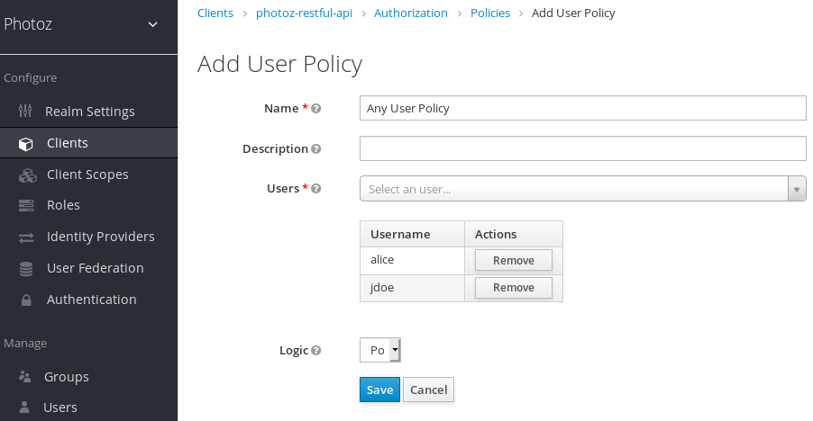

configuração

-   **nome**

>   Uma sequência humana legível e única identificando a política. Uma prática
>   recomendada é usar nomes que estejam intimamente relacionados com seus
>   requisitos de negócios e segurança, para que você possa identificá-los mais
>   facilmente.

-   **descrição**

>   Uma sequência contendo detalhes sobre esta política.

-   **Usuários**

>   Especifica quais usuários têm acesso por esta política.

-   **lógica**

>   A
>   [lógica](https://www.keycloak.org/docs/latest/authorization_services/index.html#_policy_logic)
>   desta política a ser aplicada após as outras condições foram avaliadas.

Política baseada em papéis

Você pode usar esse tipo de política para definir condições para suas permissões
onde um conjunto de um ou mais papéis é permitido acessar um objeto.

Por padrão, as funções adicionadas a esta política não são especificadas
conforme necessário e a política concederá acesso se o usuário que solicitar
acesso tiver sido concedido a qualquer uma dessas funções. No entanto, você pode
especificar uma função específica conforme
[necessário](https://www.keycloak.org/docs/latest/authorization_services/index.html#_policy_rbac_required)
se quiser impor uma função específica. Você também pode combinar funções
necessárias e não obrigatórias, independentemente de serem funções de reino ou
cliente.

As políticas de função podem ser úteis quando você precisa de um controle de
acesso baseado em papel mais restrito (RBAC), onde funções específicas devem ser
aplicadas para conceder acesso a um objeto. Por exemplo, você pode impor que um
usuário deve consentir em permitir que um aplicativo cliente (que está agindo em
nome do usuário) acesse os recursos do usuário. Você pode usar o Keycloak Client
Scope Mapping para ativar páginas de consentimento ou até mesmo impor que os
clientes forneçam explicitamente um escopo ao obter tokens de acesso a partir de
um servidor Keycloak.

Para criar uma nova política baseada em papel, selecione **Role** na lista
suspensa no canto superior direito da lista de políticas.

Adicionar política baseada em papel

configuração

-   **nome**

>   Uma sequência humana legível e única descrevendo a política. Uma prática
>   recomendada é usar nomes que estejam intimamente relacionados com seus
>   requisitos de negócios e segurança, para que você possa identificá-los mais
>   facilmente.

-   **descrição**

>   Uma sequência contendo detalhes sobre esta política.

-   **Papéis de Reino**

>   Especifica quais **funções de reino** são permitidas por esta política.

-   **Funções do cliente**

>   Especifica quais funções **do cliente** são permitidas por esta política.
>   Para habilitar este campo deve primeiro selecionar um Cliente.

-   **lógica**

>   A
>   [lógica](https://www.keycloak.org/docs/latest/authorization_services/index.html#_policy_logic)
>   desta política a ser aplicada após as outras condições foram avaliadas.

Definindo um papel conforme necessário

Ao criar uma política baseada em papel, você pode especificar uma função
específica como Necessário. Quando você fizer isso, a apólice concederá acesso
somente se o usuário que solicitar acesso tiver sido concedido todas **as**
funções **necessárias.** Tanto as funções do reino quanto do cliente podem ser
configuradas como tal.

Exemplo de Papel Obrigatório

Para especificar uma função conforme necessário, selecione a caixa de seleção
necessária para a função que deseja configurar conforme necessário.

As funções necessárias podem ser úteis quando sua política define múltiplas
funções, mas apenas um subconjunto deles é obrigatório. Neste caso, você pode
combinar funções de reino e cliente para permitir um modelo de controle de
acesso baseado em papel (RBAC) ainda mais fino para sua aplicação. Por exemplo,
você pode ter políticas específicas para um cliente e exigir uma função
específica do cliente associada a esse cliente. Ou você pode impor que o acesso
é concedido apenas na presença de um papel específico do reino. Você também pode
combinar ambas as abordagens dentro da mesma política.

Política baseada em JavaScript

|   | Se a implementação da sua política estiver usando o CONTROLE de acesso baseado em atributos (ABAC) como nos exemplos abaixo, certifique-se de que os usuários não são capazes de editar os atributos protegidos e os atributos correspondentes são somente leitura. Veja os detalhes no [capítulo de mitigação](https://www.keycloak.org/docs/latest/server_admin/#_read_only_user_attributes)do modelo Ameaça. |
|---|-----------------------------------------------------------------------------------------------------------------------------------------------------------------------------------------------------------------------------------------------------------------------------------------------------------------------------------------------------------------------------------------------------------------|

Você pode usar esse tipo de política para definir condições para suas permissões
usando JavaScript. É um dos tipos de políticas baseados em regras apoiados pelo
Keycloak e fornece flexibilidade para escrever qualquer política baseada na [API
de
avaliação](https://www.keycloak.org/docs/latest/authorization_services/index.html#_policy_evaluation_api).

Para criar uma nova política baseada em JavaScript, selecione **JavaScript** na
lista suspensa no canto superior direito da lista de políticas.

|   | Por padrão, as Políticas JavaScript não podem ser carregadas no servidor. Você deve preferir a implantação de suas políticas JS diretamente no servidor, conforme descrito nos [Provedores JavaScript](https://www.keycloak.org/docs/latest/server_development/#_script_providers). Se você ainda quiser usar o Console de Administração Keycloak para gerenciar suas políticas JS, você deve habilitar o recurso Upload Scripts. |
|---|-----------------------------------------------------------------------------------------------------------------------------------------------------------------------------------------------------------------------------------------------------------------------------------------------------------------------------------------------------------------------------------------------------------------------------------|

Adicionar política JavaScript

configuração

-   **nome**

>   Uma sequência humana legível e única descrevendo a política. Uma prática
>   recomendada é usar nomes que estejam intimamente relacionados com seus
>   requisitos de negócios e segurança, para que você possa identificá-los mais
>   facilmente.

-   **descrição**

>   Uma sequência contendo detalhes sobre esta política.

-   **código**

>   O código JavaScript fornecendo as condições para esta política.

-   **lógica**

>   A
>   [lógica](https://www.keycloak.org/docs/latest/authorization_services/index.html#_policy_logic)
>   desta política a ser aplicada após as outras condições foram avaliadas.

Criando uma política JS a partir de um arquivo JAR implantado

O Keycloak permite que você implante um arquivo JAR para implantar scripts no
servidor. Por favor, dê uma olhada nos [Provedores
JavaScript](https://www.keycloak.org/docs/latest/server_development/#_script_providers)
para obter mais detalhes.

Depois de ter seus scripts implantados, você deve ser capaz de selecionar os
scripts que você implantou na lista de provedores de políticas disponíveis.

Exemplos

Verificando atributos do contexto de avaliação

Aqui está um exemplo simples de uma política baseada em JavaScript que usa o
controle de acesso baseado em atributos (ABAC) para definir uma condição baseada
em um atributo obtido a partir do contexto de execução:

contexto var = \$evaluation.getContext();

**contexto do** varAttributes = context.getAttributes();

**se** (contextAttributes.containsValue('kc.client.network.ip_address',
'127.0.0.1')) {

\$evaluation.grant();

}

Verificando se há atributos da identidade atual

Aqui está um exemplo simples de uma política baseada em JavaScript que usa o
controle de acesso baseado em atributos (ABAC) para definir uma condição baseada
em um atributo obtido associado à identidade atual:

contexto var = \$evaluation.getContext();

var identidade = context.getIdentity();

atributos var = identidade.getAtributos();

**var** email = attributes.getValue('e-mail').asString(0);

**se** (email.endsWith('\@keycloak.org')) {

\$evaluation.grant();

}

Quando esses atributos são mapeados a partir de qualquer reivindicação definida
no token que foi usado na solicitação de autorização.

Verificando os papéis concedidos à identidade atual

Você também pode usar o CONTROLE de Acesso Baseado em Papel (RBAC) em suas
políticas. No exemplo abaixo, verificamos se um usuário é concedido com uma
keycloak_user função **de reino:**

contexto var = \$evaluation.getContext();

var identidade = context.getIdentity();

**se** (identity.hasRealmRole('keycloak_user')) {

\$evaluation.grant();

}

Ou você pode verificar se um usuário é concedido com uma função **cliente**
minha-função cliente, onde meu cliente é o id cliente do aplicativo do cliente:

contexto var = \$evaluation.getContext();

var identidade = context.getIdentity();

**se** (identity.hasClientRole('meu cliente', 'meu-cliente-papel')) {

\$evaluation.grant();

}

Verificando as funções concedidas a um usuário

Para verificar se há funções de reino concedidas a um usuário:

**var** realm = \$evaluation.getRealm();

**se** (realm.isUserInRealmRole('marta', 'role-a')) {

\$evaluation.grant();

}

Ou para funções de cliente concedidas a um usuário:

**var** realm = \$evaluation.getRealm();

**se** (realm.isUserInClientRole('marta', 'meu cliente', 'algum papel de
cliente')) {

\$evaluation.grant();

}

Verificando os papéis concedidos a um grupo

Para verificar os papéis de reino concedidos a um grupo:

**var** realm = \$evaluation.getRealm();

**se** (realm.isGroupInRole('/Grupo A/Grupo D', 'Role-a')) {

\$evaluation.grant();

}

Empurrando reivindicações arbitrárias para o servidor de recursos

Para empurrar reivindicações arbitrárias ao servidor de recursos, a fim de
fornecer informações adicionais sobre como as permissões devem ser aplicadas:

permissão do var = \$evaluation.getPermission();

*decidir se a permissão deve ser concedida*

**se** (concedido) {

permission.addClaim('claim-a', 'claim-a');

permission.addClaim('claim-a', 'claim-a1');

permission.addClaim('claim-b', 'claim-b');

}

Verificando se há membros em grupo

**var** realm = \$evaluation.getRealm();

**se** (realm.isUserInGroup('marta', '/Grupo A/Grupo B')) {

\$evaluation.grant();

}

Misturando diferentes mecanismos de controle de acesso

Você também pode usar uma combinação de vários mecanismos de controle de acesso.
O exemplo abaixo mostra como as verificações de funções (RBAC) e de
sinistros/atributos (ABAC) podem ser usadas dentro da mesma política. Neste
caso, verificamos se o usuário é concedido com função de administrador ou tem um
e-mail de keycloak.org domínio:

contexto var = \$evaluation.getContext();

var identidade = context.getIdentity();

atributos var = identidade.getAtributos();

**var** email = attributes.getValue('e-mail').asString(0);

**se** (identity.hasRealmRole('admin') \|\|e-mail.endsCom('\@keycloak.org')) {

\$evaluation.grant();

}

|   | Ao escrever suas próprias regras, tenha em mente que o **objeto \$evaluation** é um objeto implementando **org.keycloak.authorization.policy.evaluation.Evaluation**. Para obter mais informações sobre o que você pode acessar a partir desta interface, consulte a API [de avaliação](https://www.keycloak.org/docs/latest/authorization_services/index.html#_policy_evaluation_api). |
|---|-----------------------------------------------------------------------------------------------------------------------------------------------------------------------------------------------------------------------------------------------------------------------------------------------------------------------------------------------------------------------------------------|

Política baseada no tempo

Você pode usar esse tipo de política para definir condições de tempo para suas
permissões.

Para criar uma nova política baseada no tempo, selecione **Time** na lista
suspensa no canto superior direito da lista de políticas.

Adicionar política de tempo

configuração

-   **nome**

>   Uma sequência humana legível e única descrevendo a política. Uma prática
>   recomendada é usar nomes que estejam intimamente relacionados com seus
>   requisitos de negócios e segurança, para que você possa identificá-los mais
>   facilmente.

-   **descrição**

>   Uma sequência contendo detalhes sobre esta política.

-   **Não antes**

>   Define o tempo anterior ao qual o acesso **não** deve ser concedido. A
>   permissão só é concedida se a data/hora atual for mais tarde ou igual a esse
>   valor.

-   **Não ligado ou depois**

>   Define o tempo após o qual o acesso **não** deve ser concedido. A permissão
>   só é concedida se a data/hora atual for mais cedo ou igual a esse valor.

-   **Dia do Mês**

>   Define o dia do mês em que o acesso deve ser concedido. Você também pode
>   especificar uma série de datas. Neste caso, a permissão só é concedida se o
>   dia atual do mês estiver entre ou igual aos dois valores especificados.

-   **mês**

>   Define o mês em que o acesso deve ser concedido. Você também pode
>   especificar uma série de meses. Neste caso, a permissão só é concedida se o
>   mês atual estiver entre ou igual aos dois valores especificados.

-   **ano**

>   Define o ano em que o acesso deve ser concedido. Você também pode
>   especificar uma série de anos. Neste caso, a permissão só é concedida se o
>   ano atual estiver entre ou igual aos dois valores especificados.

-   **hora**

>   Define a hora em que o acesso deve ser concedido. Você também pode
>   especificar uma série de horas. Neste caso, a permissão só é concedida se a
>   hora atual estiver entre ou igual aos dois valores especificados.

-   **minuto**

>   Define o minuto em que o acesso deve ser concedido. Você também pode
>   especificar uma série de minutos. Neste caso, a permissão só é concedida se
>   o minuto atual estiver entre ou igual aos dois valores especificados.

-   **lógica**

>   A
>   [lógica](https://www.keycloak.org/docs/latest/authorization_services/index.html#_policy_logic)
>   desta política a ser aplicada após as outras condições foram avaliadas.

O acesso só é concedido se todas as condições estiverem satisfeitas. Keycloak
realizará um *E com* base no resultado de cada condição.

Política Agregada

Como mencionado anteriormente, keycloak permite que você construa uma política
de políticas, um conceito referido como agregação de políticas. Você pode usar a
agregação de políticas para reutilizar as políticas existentes para construir as
mais complexas e manter suas permissões ainda mais dissociadas das políticas que
são avaliadas durante o processamento de solicitações de autorização.

Para criar uma nova política agregada, selecione **Agregado** na lista suspensa
localizada no canto superior direito da lista de políticas.

Adicionar uma política agregada

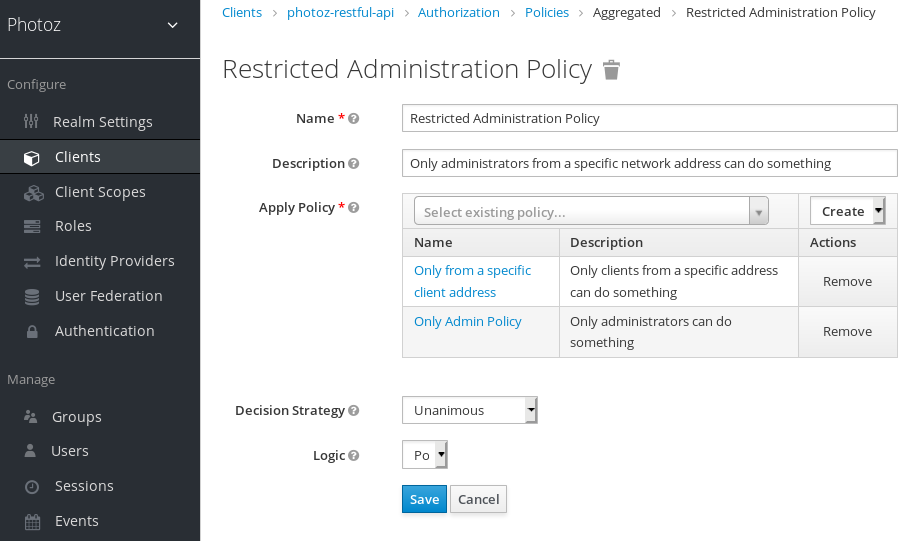

Vamos supor que você tenha um recurso chamado *Recurso Confidencial* que pode
ser acessado apenas por usuários do domínio *keycloak.org* e de uma certa gama
de endereços IP. Você pode criar uma única política com ambas as condições. No
entanto, você deseja reutilizar a parte de domínio desta política para aplicar
às permissões que operam independentemente da rede originária.

Você pode criar políticas separadas para as condições de domínio e rede e criar
uma terceira política com base na combinação dessas duas políticas. Com uma
política agregada, você pode combinar livremente outras políticas e, em seguida,
aplicar a nova política agregada a qualquer permissão que você quiser.

|   | Ao criar políticas agregadas, tenha em mente que você não está introduzindo uma referência circular ou dependência entre as políticas. Se uma dependência circular for detectada, você não poderá criar ou atualizar a política. |
|---|----------------------------------------------------------------------------------------------------------------------------------------------------------------------------------------------------------------------------------|

configuração

-   **nome**

>   Uma sequência humana legível e única descrevendo a política. Sugerimos
>   fortemente que você use nomes que estejam intimamente relacionados com seus
>   requisitos de negócios e segurança, para que você possa identificá-los mais
>   facilmente e também saber o que eles significam.

-   **descrição**

>   Uma sequência com mais detalhes sobre esta política.

-   **Aplicar política**

>   Define um conjunto de uma ou mais políticas para associar-se à política
>   agregada. Para associar uma política, você pode selecionar uma política
>   existente ou criar uma nova selecionando o tipo da política que deseja
>   criar.

-   **Estratégia de Decisão**

>   A estratégia de decisão para essa permissão.

-   **lógica**

>   A
>   [lógica](https://www.keycloak.org/docs/latest/authorization_services/index.html#_policy_logic)
>   desta política a ser aplicada após as outras condições foram avaliadas.

Estratégia de Decisão para Políticas Agregadas

Ao criar políticas agregadas, você também pode definir a estratégia de decisão
que será usada para determinar a decisão final com base no resultado de cada
política.

-   **unânime**

>   A estratégia padrão se nenhuma for fornecida. Neste caso, *todas as*
>   políticas devem avaliar uma decisão positiva para que a decisão final também
>   seja positiva.

-   **afirmativo**

>   Neste caso, *pelo menos uma* política deve avaliar uma decisão positiva para
>   que a decisão final também seja positiva.

-   **consenso**

>   Neste caso, o número de decisões positivas deve ser maior do que o número de
>   decisões negativas. Se o número de decisões positivas e negativas for o
>   mesmo, a decisão final será negativa.

Política baseada no cliente

Você pode usar esse tipo de política para definir condições para suas permissões
onde um conjunto de um ou mais clientes é permitido acessar um objeto.

Para criar uma nova política baseada no cliente, selecione **Cliente** na lista
suspensa no canto superior direito da lista de políticas.

Adicionar uma política baseada no cliente

configuração

-   **nome**

>   Uma sequência humana legível e única identificando a política. Uma prática
>   recomendada é usar nomes que estejam intimamente relacionados com seus
>   requisitos de negócios e segurança, para que você possa identificá-los mais
>   facilmente.

-   **descrição**

>   Uma sequência contendo detalhes sobre esta política.

-   **Clientes**

>   Especifica quais clientes têm acesso por esta política.

-   **lógica**

>   A
>   [lógica](https://www.keycloak.org/docs/latest/authorization_services/index.html#_policy_logic)
>   desta política a ser aplicada após as outras condições foram avaliadas.

Política baseada em grupo

Você pode usar esse tipo de política para definir condições para suas permissões
onde um conjunto de um ou mais grupos (e suas hierarquias) é permitido acessar
um objeto.

Para criar uma nova política baseada em grupo, selecione **Grupo** na lista
suspensa no canto superior direito da lista de políticas.

Adicionar política baseada em grupo

configuração

-   **nome**

>   Uma sequência humana legível e única descrevendo a política. Uma prática
>   recomendada é usar nomes que estejam intimamente relacionados com seus
>   requisitos de negócios e segurança, para que você possa identificá-los mais
>   facilmente.

-   **descrição**

>   Uma sequência contendo detalhes sobre esta política.

-   **Reivindicação de grupos**

>   Especifica o nome da solicitação no token que detém os nomes e/ou caminhos
>   do grupo. Normalmente, as solicitações de autorização são processadas com
>   base em um Token de identificação ou token de acesso previamente emitido a
>   um cliente que atua em nome de algum usuário. Se definido, o token deve
>   incluir uma reclamação de onde esta política vai obter os grupos dos que o
>   usuário faz parte. Se não for definido, os grupos do usuário são obtidos a
>   partir da configuração do seu reino.

-   **Grupos**

>   Permite selecionar os grupos que devem ser aplicados por esta política ao
>   avaliar permissões. Depois de adicionar um grupo, você pode estender o
>   acesso às crianças do grupo marcando a caixa de seleção **Extend to
>   Children**. Se não for marcada, as restrições de acesso só se aplicam ao
>   grupo selecionado.

-   **lógica**

>   A
>   [lógica](https://www.keycloak.org/docs/latest/authorization_services/index.html#_policy_logic)
>   desta política a ser aplicada após as outras condições foram avaliadas.

Ampliando o acesso a grupos infantis

Por padrão, quando você adicionar um grupo a esta política, as restrições de
acesso só se aplicarão aos membros do grupo selecionado.

Em algumas circunstâncias, pode ser necessário permitir o acesso não só ao
próprio grupo, mas a qualquer grupo infantil na hierarquia. Para qualquer grupo
adicionado, você pode marcar uma caixa de **seleção Estender para crianças,** a
fim de ampliar o acesso a grupos de crianças.

Ampliando o acesso a grupos infantis

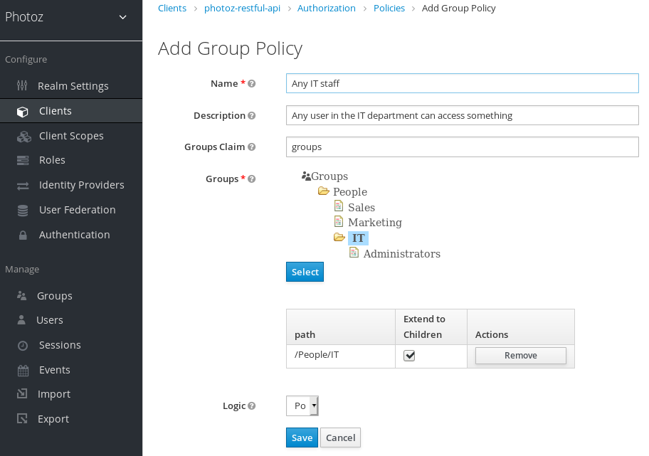

No exemplo acima, a política está concedendo acesso para qualquer usuário de
**TI** ou qualquer um de seus filhos.

Política baseada em escopo do cliente

Você pode usar esse tipo de política para definir condições para suas permissões
onde um conjunto de um ou mais escopos de clientes é permitido acessar um
objeto.

Por padrão, os escopos do cliente adicionados a esta política não são
especificados conforme necessário e a política concederá acesso se o cliente que
solicitar acesso tiver sido concedido a qualquer um desses escopos de cliente.
No entanto, você pode especificar um escopo específico do cliente, conforme
[necessário,](https://www.keycloak.org/docs/latest/authorization_services/index.html#_policy_client_scope_required)
se quiser impor um escopo específico do cliente.

Para criar uma nova política baseada no escopo do cliente, selecione **o Escopo
do Cliente** na lista suspensa no canto superior direito da lista de políticas.

Adicionar política baseada no escopo do cliente

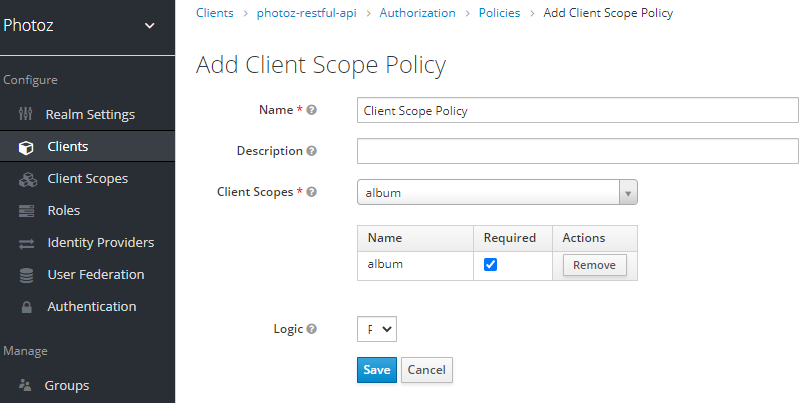

configuração

-   **nome**

>   Uma sequência humana legível e única descrevendo a política. Uma prática
>   recomendada é usar nomes que estejam intimamente relacionados com seus
>   requisitos de negócios e segurança, para que você possa identificá-los mais
>   facilmente.

-   **descrição**

>   Uma sequência contendo detalhes sobre esta política.

-   **Escopos do cliente**

>   Especifica quais escopos de clientes são permitidos por esta política.

-   **lógica**

>   A
>   [lógica](https://www.keycloak.org/docs/latest/authorization_services/index.html#_policy_logic)
>   desta política a ser aplicada após as outras condições foram avaliadas.

Definindo um escopo de cliente conforme necessário

Ao criar uma política baseada em escopo do cliente, você pode especificar um
escopo de cliente específico conforme Necessário. Quando você fizer isso, a
apólice concederá acesso somente se o cliente que solicitar acesso tiver sido
concedido todos **os** escopos de clientes necessários.

Exemplo de escopo de cliente necessário

Para especificar um escopo de cliente conforme necessário, selecione a caixa de
seleção necessária para o escopo do cliente que deseja configurar conforme
necessário.

Os escopos necessários do cliente podem ser úteis quando sua política define
vários escopos de clientes, mas apenas um subconjunto deles é obrigatório.

Lógica Positiva e Negativa

As políticas podem ser configuradas com lógica positiva ou negativa.
Resumidamente, você pode usar esta opção para definir se o resultado da política
deve ser mantido como está ou ser negado.

Por exemplo, suponha que você queira criar uma política onde apenas usuários
**não** concedidos com uma função específica devem ter acesso. Neste caso, você
pode criar uma política baseada em papel usando essa função e definir seu campo
de **lógica** como **negativo**. Se você mantiver **o Positive**, que é o
comportamentopadrão, o resultado da política será mantido como está.

API de Avaliação de Políticas

Ao escrever políticas baseadas em regras usando JavaScript, o Keycloak fornece
uma API de avaliação que fornece informações úteis para ajudar a determinar se
uma permissão deve ser concedida.

Esta API consiste em algumas interfaces que fornecem acesso a informações, como

-   A permissão está sendo avaliada, representando tanto o recurso quanto os
    escopos que estão sendo solicitados.

-   Os atributos associados ao recurso solicitado

-   Ambiente de tempo de execução e qualquer outro atributo associado ao
    contexto de execução

-   Informações sobre usuários como membros de grupos e funções

A interface principal é
**org.keycloak.authorization.policy.evaluation.Evaluation**, que define o
seguinte contrato:

**Avaliação** da interface pública {

*/\*\**

*\* Retorna a {\@link ResourcePermission} a ser avaliada.*

*\**

*\* \@return a permissão para ser avaliada*

*\*/*

ResourcePermission getPermission();

*/\*\**

*\* Retorna o {\@link EvaluationContext}. O que dá acesso a todo o contexto de
tempo de execução da avaliação.*

*\**

*\* \@return o contexto de avaliação*

*\*/*

AvaliaçãoContexto getContext();

*/\*\**

*\* Retorna um {\@link Realm} que pode ser usado por políticas para consultar
informações.*

*\**

*\* \@return uma instância {\@link Realm}*

*\*/*

Reino getRealm();

*/\*\**

*\* Concede a permissão solicitada ao chamador.*

*\*/*

subvenção nula();

*/\*\**

*\* Nega a permissão solicitada.*

*\*/*

anular negar ();

}

Ao processar uma solicitação de autorização, keycloak cria uma instância de
avaliação antes de avaliar qualquer política. Esta instância é então passada
para cada política para determinar se o acesso é **GRANT** ou **DENY**.

As políticas determinam isso invocando os métodos de subvenção ou negação em uma
instância de Avaliação. Por padrão, o estado da instância de Avaliação é negado,
o que significa que suas políticas devem invocar explicitamente o método de
subvenção() para indicar ao mecanismo de avaliação da política que a permissão
deve ser concedida.

Para obter mais informações sobre a API de Avaliação, consulte os
[JavaDocs](https://www.keycloak.org/docs/15.0/api_documentation/).

O Contexto de Avaliação

O contexto de avaliação fornece informações úteis às políticas durante sua
avaliação.

**avaliação de interface públicaContext** {

*/\*\**

*\* Retorna o {\@link Identidade} que representa uma entidade (pessoa ou não) à
qual as permissões devem ser concedidas ou não.*

*\**

*\* \@return a identidade a que as permissões devem ser concedidas, ou não*

*\*/*

Identidade obter identidade();

*/\*\**

*\* Retorna todos os atributos dentro do ambiente de execução e tempo de
execução atual.*

*\**

*\* \@return os atributos dentro do ambiente atual de execução e tempo de
execução*

*\*/*

Atributos getAttributes();

}

A partir desta interface, as políticas podem obter:

-   A identidade autenticada

-   Informações sobre o contexto de execução e o ambiente de tempo de execução

A Identidade é construída com base no Token de Acesso OAuth2 que foi enviado
juntamente com o pedido de autorização, e esta construção tem acesso a todas as
reivindicações extraídas do token original. Por exemplo, se você estiver usando
um *Mapper de protocolo* para incluir uma solicitação personalizada em um Token
de Acesso OAuth2, você também pode acessar essa reclamação de uma política e
usá-la para construir suas condições.

O EvaluationContext também lhe dá acesso a atributos relacionados tanto aos
ambientes de execução quanto ao tempo de execução. Por enquanto, há apenas
alguns atributos embutidos.

| Mesa 2. Atributos de execução e tempo de execução |                                            |                                    |
|---------------------------------------------------|--------------------------------------------|------------------------------------|
| **nome**                                          | **descrição**                              | **tipo**                           |
| kc.time.date_time                                 | Data e hora atuais                         | corda. Formato MM/dd/yyyy hh:mm:ss |
| kc.client.network.ip_address                      | Endereço IPv4 do cliente                   | corda                              |
| kc.client.network.host                            | Nome do host do cliente                    | corda                              |
| kc.client.id                                      | A id do cliente                            | corda                              |
| kc.client.user_agent                              | O valor do cabeçalho HTTP 'Usuário-Agente' | String[]                           |
| kc.realm.name                                     | O nome do reino                            | corda                              |

Gerenciamento de permissões

Uma permissão associa o objeto a ser protegido e as políticas que devem ser
avaliadas para decidir se o acesso deve ser concedido.

Depois de criar os recursos que deseja proteger e as políticas que deseja usar
para proteger esses recursos, você pode começar a gerenciar permissões. Para
gerenciar permissões, clique na guia **Permissões** ao editar um servidor de
recursos.

Permissões

As permissões podem ser criadas para proteger dois tipos principais de objetos:

-   **Recursos**

-   **Escopos**

Para criar uma permissão, selecione o tipo de permissão que deseja criar na
lista suspensa no canto superior direito da lista de permissões. As seções a
seguir descrevem esses dois tipos de objetos com mais detalhes.

Criando permissões baseadas em recursos

Uma permissão baseada em recursos define um conjunto de um ou mais recursos para
proteger usando um conjunto de uma ou mais políticas de autorização.

Para criar uma nova permissão baseada em recursos, selecione **Recurso baseado**
na lista suspensa no canto superior direito da lista de permissões.

Adicionar permissão baseada em recursos

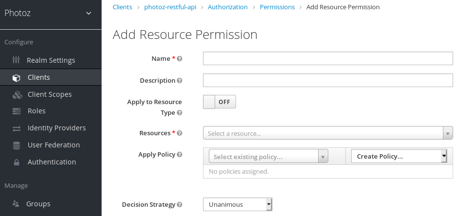

configuração

-   **nome**

>   Uma corda humana legível e única descrevendo a permissão. Uma prática
>   recomendada é usar nomes que estejam intimamente relacionados com seus
>   requisitos de negócios e segurança, para que você possa identificá-los mais
>   facilmente.

-   **descrição**

>   Uma sequência contendo detalhes sobre esta permissão.

-   **Aplicar ao tipo de recurso**

>   Especifica se a permissão é aplicada a todos os recursos com um determinado
>   tipo. Ao selecionar este campo, você é solicitado a inserir o tipo de
>   recurso para proteger.

-   Tipo de recurso

>   Define o tipo de recurso para proteger. Quando definida, essa permissão é
>   avaliada para todos os recursos que correspondem a esse tipo.

-   **Recursos**

>   Define um conjunto de um ou mais recursos para proteger.

-   **Aplicar política**

>   Define um conjunto de uma ou mais políticas para associar a uma permissão.
>   Para associar uma política, você pode selecionar uma política existente ou
>   criar uma nova selecionando o tipo da política que deseja criar.

-   **Estratégia de Decisão**

>   A [Estratégia de
>   Decisão](https://www.keycloak.org/docs/latest/authorization_services/index.html#_permission_decision_strategies)
>   para essa permissão.

Permissão de recurso digitado

As permissões de recursos também podem ser usadas para definir políticas que
devem ser aplicadas a todos os recursos com um determinado
[tipo](https://www.keycloak.org/docs/latest/authorization_services/index.html#_resource_create_type).
Essa forma de permissão baseada em recursos pode ser útil quando você tem
recursos compartilhando requisitos e restrições comuns de acesso.

Frequentemente, os recursos dentro de um aplicativo podem ser categorizados (ou
digitados) com base nos dados que encapsulam ou na funcionalidade que fornecem.
Por exemplo, um aplicativo financeiro pode gerenciar diferentes contas bancárias
onde cada uma pertence a um cliente específico. Embora sejam contas bancárias
diferentes, elas compartilham requisitos e restrições comuns de segurança que
são definidas globalmente pela organização bancária. Com permissões de recursos
digitado, você pode definir políticas comuns para aplicar em todas as contas
bancárias, tais como:

-   Só o proprietário pode gerenciar sua conta

-   Só permita o acesso do país e/ou região do proprietário

-   Imponha um método de autenticação específico

Para criar uma permissão de recurso digitado, clique em [Solicitar o Tipo de
Recurso
ao](https://www.keycloak.org/docs/latest/authorization_services/index.html#_permission_create_resource_apply_resource_type)
criar uma nova permissão baseada em recursos. Com o Aplicar ao tipo de recurso
definido para On,você pode especificar o tipo que deseja proteger, bem como as
políticas que devem ser aplicadas para reger o acesso a todos os recursos com o
tipo especificado.

Exemplo de uma permissão de recurso digitado

Criando permissões baseadas em escopo

Uma permissão baseada em escopo define um conjunto de um ou mais escopos para
proteger usando um conjunto de uma ou mais políticas de autorização. Ao
contrário das permissões baseadas em recursos, você pode usar esse tipo de
permissão para criar permissões não apenas para um recurso, mas também para os
escopos associados a ele, fornecendo mais granularidade ao definir as permissões
que regem seus recursos e as ações que podem ser executadas neles.

Para criar uma nova permissão baseada em escopo, selecione **Escopo na** lista
suspensa no canto superior direito da lista de permissões.

Adicionar permissão baseada em escopo

configuração

-   **nome**

>   Uma corda humana legível e única descrevendo a permissão. Uma prática
>   recomendada é usar nomes que estejam intimamente relacionados com seus
>   requisitos de negócios e segurança, para que você possa identificá-los mais
>   facilmente.

-   **descrição**

>   Uma sequência contendo detalhes sobre esta permissão.

-   **recurso**

>   Restringe os escopos aos associados ao recurso selecionado. Se nenhum for
>   selecionado, todos os escopos estiverem disponíveis.

-   **Escopos**

>   Define um conjunto de um ou mais escopos para proteger.

-   **Aplicar política**

>   Define um conjunto de uma ou mais políticas para associar a uma permissão.
>   Para associar uma política, você pode selecionar uma política existente ou
>   criar uma nova selecionando o tipo da política que deseja criar.

-   **Estratégia de Decisão**

>   A [Estratégia de
>   Decisão](https://www.keycloak.org/docs/latest/authorization_services/index.html#_permission_decision_strategies)
>   para essa permissão.

Estratégias de decisão política

Ao associar políticas com uma permissão, você também pode definir uma estratégia
de decisão para especificar como avaliar o resultado das políticas associadas
para determinar o acesso.

-   **unânime**

>   A estratégia padrão se nenhuma for fornecida. Neste caso, *todas as*
>   políticas devem avaliar uma decisão positiva para que a decisão final também
>   seja positiva.

-   **afirmativo**

>   Neste caso, *pelo menos uma* política deve avaliar uma decisão positiva para
>   que a decisão final também seja positiva.

-   **consenso**

>   Neste caso, o número de decisões positivas deve ser maior do que o número de
>   decisões negativas. Se o número de decisões positivas e negativas for igual,
>   a decisão final será negativa.

Avaliando e testando políticas

Ao projetar suas políticas, você pode simular solicitações de autorização para
testar como suas políticas estão sendo avaliadas.

Você pode acessar a Ferramenta de Avaliação de Políticas clicando na guia
Avaliar ao editar um servidor de recursos. Lá você pode especificar diferentes
entradas para simular solicitações de autorização reais e testar o efeito de
suas políticas.

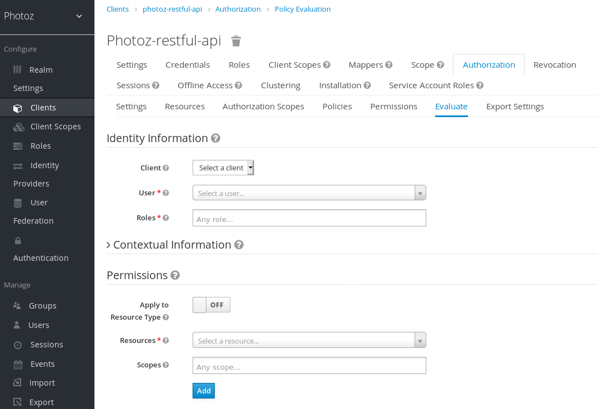

Fornecendo informações de identidade

Os filtros **de informações de identidade** podem ser usados para especificar as
permissões solicitando ao usuário.

Fornecendo informações contextuais

Os filtros **de Informações Contextuais** podem ser usados para definir
atributos adicionais ao contexto de avaliação, para que as políticas possam
obter esses mesmos atributos.

Fornecendo as Permissões

Os **filtros Permissões** podem ser usados para construir uma solicitação de
autorização. Você pode solicitar permissões para um conjunto de um ou mais
recursos e escopos. Se você quiser simular solicitações de autorização com base
em todos os recursos e escopos protegidos, clique em **Adicionar** sem
especificar quaisquer Recursos ou Escopos.

Quando você especificar os valores desejados, clique em **Avaliar**.

Serviços de Autorização

Os Serviços de Autorização de Keycloak são construídos em cima de padrões bem
conhecidos, como as especificações OAuth2 e User-Managed Access.

Os clientes OAuth2 (como aplicativos front-end) podem obter tokens de acesso do
servidor usando o ponto final do token e usar esses mesmos tokens para acessar
recursos protegidos por um servidor de recursos (como serviços de back-end). Da
mesma forma, os Serviços de Autorização Keycloak fornecem extensões ao OAuth2
para permitir que os tokens de acesso sejam emitidos com base no processamento
de todas as políticas associadas aos recursos ou escopos que estão sendo
solicitados. Isso significa que os servidores de recursos podem impor o acesso
aos seus recursos protegidos com base nas permissões concedidas pelo servidor e
mantidas por um token de acesso. Nos Serviços de Autorização Keycloak, o token
de acesso com permissões é chamado de Token de Parte Solicitante ou RPT para
abreviar.

Além da emissão de RPTs, o Keycloak Authorization Services também fornece um
conjunto de pontos finais RESTful que permitem que os servidores de recursos
gerenciem seus recursos protegidos, escopos, permissões e políticas, ajudando os
desenvolvedores a estender ou integrar esses recursos em seus aplicativos, a fim
de suportar a autorização de grãos finos.

Descobrindo pontos finais e metadados dos serviços de autorização

O Keycloak fornece um documento de descoberta a partir do qual os clientes podem
obter todas as informações necessárias para interagir com os Serviços de
Autorização keycloak, incluindo locais e recursos de ponto final.

O documento de descoberta pode ser obtido a partir de:

curl -X GET \\

http://\${host}:\${port}/auth/realms/\${realm}/.well-known/uma2-configuration

Onde \${host}:\${port} é o nome de host (ou endereço IP) e a porta onde o
Keycloak está funcionando e \${reino} é o nome de um reino em Keycloak.

Como resultado, você deve obter uma resposta da seguinte forma:

{

algumas reivindicações são esperadas aqui

estas são as principais reivindicações no documento de descoberta sobre a
localização de endpoints dos Serviços de Autorização

"token_endpoint":
"http://\${host}:\${port}/auth/realms/\${realm}/protocol/openid-connect/token",

"token_introspection_endpoint":
"http://\${host}:\${port}/auth/realms/\${realm}/protocol/openid-connect/token/introspect",

"resource_registration_endpoint":
"http://\${host}:\${port}/auth/realms/\${realm}/authz/protection/resource_set",

"permission_endpoint":
"http://\${host}:\${port}/auth/realms/\${realm}/authz/protection/permission",

"policy_endpoint":
"http://\${host}:\${port}/auth/realms/\${realm}/authz/protection/uma-policy"

}

Cada um desses pontos finais expõe um conjunto específico de recursos:

-   **token_endpoint**

>   Um Ponto final de token compatível com OAuth2 que suporta a
>   urna:ietf:params:oauth:grant-type:uma-ticket grant type. Através deste ponto
>   final, os clientes podem enviar solicitações de autorização e obter um RPT
>   com todas as permissões concedidas pela Keycloak.

-   **token_introspection_endpoint**

>   Um Endpoint de introspecção de token compatível com OAuth2, que os clientes
>   podem usar para consultar o servidor para determinar o estado ativo de um
>   RPT e para determinar quaisquer outras informações associadas ao token, como
>   as permissões concedidas pelo Keycloak.

-   **resource_registration_endpoint**

>   Um ponto final de registro de recursos compatível com UMA que os servidores
>   de recursos podem usar para gerenciar seus recursos e escopos protegidos.
>   Este ponto final fornece operações de criação, leitura, atualização e
>   exclusão de recursos e escopos no Keycloak.

-   **permission_endpoint**

>   Um Endpoint de permissão compatível com UMA que os servidores de recursos
>   podem usar para gerenciar bilhetes de permissão. Este ponto final fornece
>   operações de criação, leitura, atualização e exclusão de tickets de
>   permissão no Keycloak.

Obtenção de permissões

Para obter permissões da Keycloak, você envia uma solicitação de autorização
para o ponto final do token. Como resultado, o Keycloak avaliará todas as
políticas associadas aos recursos e escopos que estão sendo solicitados e
emitirá um RPT com todas as permissões concedidas pelo servidor.

Os clientes podem enviar solicitações de autorização para o ponto final do token
usando os seguintes parâmetros:

-   **grant_type**

>   Este parâmetro é **necessário**. Deve ser
>   urna:ietf:params:oauth:grant-type:uma-ticket.

-   **bilhete**

>   Este parâmetro é **opcional.** O mais recente bilhete de permissão recebido
>   pelo cliente como parte do processo de autorização da UMA.

-   **claim_token**

>   Este parâmetro é **opcional.** Uma sequência representando reivindicações
>   adicionais que devem ser consideradas pelo servidor ao avaliar as permissões
>   para os recursos e escopos que estão sendo solicitados. Este parâmetro
>   permite que os clientes empurrem reivindicações para Keycloak. Para obter
>   mais detalhes sobre todos os formatos de token suportados, consulte
>   claim_token_format parâmetro.

-   **claim_token_format**

>   Este parâmetro é **opcional.** Uma sequência indicando o formato do token
>   especificado no parâmetro claim_token. Keycloak suporta dois formatos de
>   token: urn:ietf:params:oauth:token-type:jwt e
>   <https://openid.net/specs/openid-connect-core-1_0.html#IDToken>. O formato
>   urn:ietf:params:oauth:token-type:jwt indica que o parâmetro claim_token faz
>   referência a um token de acesso. O
>   <https://openid.net/specs/openid-connect-core-1_0.html#IDToken> indica que o
>   parâmetro claim_token faz referência a um OpenID Connect ID Token.

-   **Rpt**

>   Este parâmetro é **opcional.** Um RPT emitido anteriormente, quais
>   permissões também devem ser avaliadas e adicionadas em uma nova. Este
>   parâmetro permite que os clientes em posse de um RPT realizem autorização
>   incremental onde as permissões são adicionadas sob demanda.

-   **permissão**

>   Este parâmetro é **opcional.** Uma string representando um conjunto de um ou
>   mais recursos e escopos que o cliente está buscando acesso. Este parâmetro
>   pode ser definido várias vezes para solicitar permissão para vários recursos
>   e escopos. Este parâmetro é uma extensão para
>   urn:ietf:params:oauth:grant-type:uma-ticket grant type, a fim de permitir
>   que os clientes enviem solicitações de autorização sem um bilhete de
>   permissão. O formato da string deve ser: RESOURCE_ID\#SCOPE_ID. Por exemplo:
>   Recurso A\#Scope A, Recurso A\#Escopo A, Escopo B, Escopo C, Recurso A,
>   \#Scope A.

-   **público**

>   Este parâmetro é **opcional.** O identificador do cliente do servidor de
>   recursos ao qual o cliente está buscando acesso. Este parâmetro é
>   obrigatório caso o parâmetro de permissão seja definido. Serve como uma dica
>   para Keycloak indicar o contexto em que as permissões devem ser avaliadas.

-   **response_include_resource_name**

>   Este parâmetro é **opcional.** Um valor booleano indicando ao servidor se os
>   nomes dos recursos devem ser incluídos nas permissões do RPT. Se for falso,
>   apenas o identificador de recursos está incluído.

-   **response_permissions_limit**

>   Este parâmetro é **opcional.** Um N inteiro que define um limite para a
>   quantidade de permissões que um RPT pode ter. Quando usado em conjunto com o
>   parâmetro rpt, apenas as últimas permissões N solicitadas serão mantidas no
>   RPT.

-   **submit_request**

>   Este parâmetro é **opcional.** Um valor booleano indicando se o servidor
>   deve criar solicitações de permissão para os recursos e escopos
>   referenciados por um ticket de permissão. Este parâmetro só tem efeito se
>   usado em conjunto com o parâmetro de bilhete como parte de um processo de
>   autorização uma.

-   **response_mode**

>   Este parâmetro é **opcional.** Um valor de sequência indicando como o
>   servidor deve responder às solicitações de autorização. Este parâmetro é
>   especialmente útil quando você está interessado principalmente na decisão
>   geral ou nas permissões concedidas pelo servidor, em vez de uma resposta
>   OAuth2 padrão. Os valores possíveis são:

-   decisão

>   Indica que as respostas do servidor só devem representar a decisão geral
>   retornando um JSON com o seguinte formato:

>   {

>   'resultado': verdadeiro

>   }

>   Se a solicitação de autorização não mapear qualquer permissão, um código de
>   status HTTP 403 será devolvido em vez disso.

-   Permissões

>   Indica que as respostas do servidor devem conter qualquer permissão
>   concedida pelo servidor retornando um JSON com o seguinte formato:

>   [

>   {

>   'rsid': 'Meu Recurso'

>   'escopos': ['view', 'update']

>   },

>   ...

>   ]

>   Se a solicitação de autorização não mapear qualquer permissão, um código de
>   status HTTP 403 será devolvido em vez disso.

Exemplo de solicitação de autorização quando um cliente está buscando acesso a
dois recursos protegidos por um servidor de recursos.

curl -X POST \\

http://\${host}:\${port}/auth/realms/\${realm}/protocol/openid-connect/token \\

\-H "Autorização: Portador \${access_token}" \\

\-dados "grant_type=urn:ietf:params:oauth:grant-type:uma-ticket" \\

\-dados "audience={resource_server_client_id}" \\

\-dados "permission=Resource A\#Scope A" \\

\-dados "permission=Resource B\#Scope B"

Exemplo de uma solicitação de autorização quando um cliente está buscando acesso
a qualquer recurso e escopo protegido por um servidor de recursos.

curl -X POST \\

http://\${host}:\${port}/auth/realms/\${realm}/protocol/openid-connect/token \\

\-H "Autorização: Portador \${access_token}" \\

\-dados "grant_type=urn:ietf:params:oauth:grant-type:uma-ticket" \\

\-dados "audience={resource_server_client_id}"

Exemplo de solicitação de autorização quando um cliente está buscando acesso a
um recurso protegido uma depois de receber um bilhete de permissão do servidor
de recursos como parte do processo de autorização:

curl -X POST \\

http://\${host}:\${port}/auth/realms/\${realm}/protocol/openid-connect/token \\

\-H "Autorização: Portador \${access_token}" \\

\-dados "grant_type=urn:ietf:params:oauth:grant-type:uma-ticket" \\

\-dados "ticket=\${permission_ticket}

Se o processo de avaliação keycloak resultar na emissão de permissões, ele
emitirá o RPT com o qual associou as permissões:

Keycloak responde ao cliente com o RPT

HTTP/1.1 200 OK

Tipo de conteúdo: aplicativo/json

...

{

"access_token": "\${rpt}",

}

A resposta do servidor é como qualquer outra resposta do ponto final do token ao
usar algum outro tipo de concessão. O RPT pode ser obtido a partir do parâmetro
de resposta access_token. Se o cliente não estiver autorizado, o Keycloak
responderá com um código de status HTTP 403:

Keycloak nega o pedido de autorização

HTTP/1.1 403 Proibido

Tipo de conteúdo: aplicativo/json

...

{

"erro": "access_denied",

"error_description": "request_denied"

}

Métodos de autenticação do cliente

Os clientes precisam autenticar para o ponto final do token para obter um RPT.
Ao usar a urna:ietf:params:oauth:grant-type:uma-ticket grant type, os clientes
podem usar qualquer um desses métodos de autenticação:

-   **Token portador**

>   Os clientes devem enviar um token de acesso como credencial do Portador em
>   um cabeçalho de autorização HTTP para o ponto final do token.

>   Exemplo: uma solicitação de autorização usando um token de acesso para
>   autenticar no ponto final do token

>   curl -X POST \\

>   http://\${host}:\${port}/auth/realms/\${realm}/protocol/openid-connect/token
>   \\

>   \-H "Autorização: Portador \${access_token}" \\

>   \-dados "grant_type=urn:ietf:params:oauth:grant-type:uma-ticket"

>   Este método é especialmente útil quando o cliente está agindo em nome de um
>   usuário. Neste caso, o token portador é um token de acesso previamente
>   emitido pela Keycloak para algum cliente agindo em nome de um usuário (ou em
>   nome de si mesmo). As permissões serão avaliadas considerando o contexto de
>   acesso representado pelo token de acesso. Por exemplo, se o token de acesso
>   foi emitido ao Cliente A agindo em nome do Usuário A, as permissões serão
>   concedidas dependendo dos recursos e escopos aos quais o Usuário A tem
>   acesso.

-   **Credenciais do Cliente**

>   Os clientes podem usar qualquer um dos métodos de autenticação do cliente
>   suportados pela Keycloak. Por exemplo, client_id/client_secret ou JWT.

>   Exemplo: uma solicitação de autorização usando o id do cliente e o segredo
>   do cliente para autenticar ao ponto final do token

>   curl -X POST \\

>   http://\${host}:\${port}/auth/realms/\${realm}/protocol/openid-connect/token
>   \\

>   \-H "Autorização: Basic cGhvdGg6L7Jl13RmfWgtkk==pOnNlY3JldA=" \\

>   \-dados "grant_type=urn:ietf:params:oauth:grant-type:uma-ticket"

Empurrando reivindicações

Ao obter permissões do servidor, você pode empurrar reclamações arbitrárias para
ter essas reivindicações disponíveis para suas políticas ao avaliar permissões.

Se você estiver obtendo permissões do servidor **sem** usar um bilhete de
permissão (fluxo UMA), você pode enviar uma solicitação de autorização para o
ponto final do token da seguinte forma:

curl -X POST \\

http://\${host}:\${port}/auth/realms/\${realm}/protocol/openid-connect/token \\

\-dados "grant_type=urn:ietf:params:oauth:grant-type:uma-ticket" \\

\-Dados "claim_token=ewogICAib3JnYW5pemF0aW9uIjogWyJhY21lIl0KfQ== " \\

\-dados "claim_token_format=urn:ietf:params:oauth:token-type:jwt" \\

\-dados "client_id={resource_server_client_id}" \\

\-dados "client_secret={resource_server_client_secret}" \\

\-dados "audience={resource_server_client_id}"

O parâmetro claim_token espera um JSON codificado base64 com um formato
semelhante ao exemplo abaixo:

{

"organização" .

}

O formato espera uma ou mais reivindicações onde o valor de cada reivindicação
deve ser uma matriz de strings.

Empurrando reivindicações usando uma

Para obter mais detalhes sobre como empurrar sinistros ao usar um e bilhetes de
permissão, por favor, dê uma olhada na [API de
permissão](https://www.keycloak.org/docs/latest/authorization_services/index.html#_service_protection_permission_api_papi)

Acesso gerenciado pelo usuário

O Keycloak Authorization Services é baseado no Acesso Gerenciado pelo Usuário ou
uma uma para abreviar. Uma é uma especificação que melhora os recursos do OAuth2
das seguintes maneiras:

-   **privacidade**

>   Hoje em dia, a privacidade do usuário está se tornando uma grande
>   preocupação, à medida que cada vez mais dados e dispositivos estão
>   disponíveis e conectados à nuvem. Com a UMA e o Keycloak, os servidores de
>   recursos podem melhorar seus recursos para melhorar a forma como seus
>   recursos são protegidos em relação à privacidade do usuário, onde as
>   permissões são concedidas com base em políticas definidas pelo usuário.

-   **Autorização partidária**

>   Os proprietários de recursos (por exemplo: usuários finais regulares) podem
>   gerenciar o acesso aos seus recursos e autorizar outras partes (por exemplo:
>   usuários finais regulares) a acessar esses recursos. Isso é diferente do
>   OAuth2, quando o consentimento é dado a um aplicativo de cliente agindo em
>   nome de um usuário, com os proprietários de recursos da UMA podem consentir
>   o acesso a outros usuários, de forma completamente assíncrola.

-   **Compartilhamento de recursos**

>   Os proprietários de recursos podem gerenciar permissões para seus recursos e
>   decidir quem pode acessar um determinado recurso e como. O Keycloak pode
>   então atuar como um serviço de gerenciamento de compartilhamento a partir do
>   qual os proprietários de recursos podem gerenciar seus recursos.

Keycloak é um servidor de autorização compatível com UMA 2.0 que fornece a
maioria dos recursos uma.

Como exemplo, considere uma dona de recurso Alice (dona de recursos) usando um
Serviço de Internet Banking (servidor de recursos) para gerenciar sua Conta
Bancária (recurso). Um dia, Alice decide abrir sua conta bancária para Bob
(parte solicitante), um profissional de contabilidade. No entanto, Bob só deve
ter acesso à conta de Alice.

Como servidor de recursos, o Serviço de Internet Banking deve ser capaz de
proteger a conta bancária de Alice. Para isso, ele conta com o Keycloak Resource
Registration Endpoint para criar um recurso no servidor representando a Conta
Bancária de Alice.

Neste momento, se Bob tentar acessar a conta bancária de Alice, o acesso será
negado. O Internet Banking Service define algumas políticas padrão para contas
bancárias. Uma delas é que apenas a dona, neste caso Alice, pode acessar sua
conta bancária.

No entanto, o Internet Banking Service em relação à privacidade de Alice também
permite que ela mude políticas específicas para a conta bancária. Uma dessas
políticas que ela pode mudar é definir quais pessoas podem ver sua conta
bancária. Para isso, o Internet Banking Service conta com o Keycloak para
fornecer a Alice um espaço onde ela possa selecionar indivíduos e as operações
(ou dados) que eles podem acessar. A qualquer momento, Alice pode revogar o
acesso ou conceder permissões adicionais ao Bob.

Processo de Autorização

Na UMA, o processo de autorização começa quando um cliente tenta acessar um
servidor de recursos protegido uma.

Um servidor de recurso protegido uma espera um token portador na solicitação
onde o token é um RPT. Quando um cliente solicita um recurso no servidor de
recursos sem um bilhete de permissão:

Cliente solicita um recurso protegido sem enviar um RPT

curl -X GET \\

http://\${host}:\${port}/my-resource-server/resource/1bfdfe78-a4e1-4c2d-b142-fc92b75b986f

O servidor de recursos envia uma resposta de volta ao cliente com um bilhete de
permissão e um parâmetro as_uri com a localização de um servidor Keycloak para
onde o bilhete deve ser enviado para obter um RPT.

Servidor de recursos responde com um ticket de permissão

HTTP/1.1 401 Não Autorizado

WWW-Authenticate: UM realm="\${realm}",

as_uri="https://\${host}:\${port}/auth/realms/\${realm}",

ticket="016f84e8-f9b9-11e0-bd6f-0021cc6004de"

O bilhete de permissão é um tipo especial de token emitido pela Keycloak
Permission API. Eles representam as permissões solicitadas (por exemplo:
recursos e escopos) bem como quaisquer outras informações associadas à
solicitação. Apenas servidores de recursos podem criar esses tokens.

Agora que o cliente tem um bilhete de permissão e também a localização de um
servidor Keycloak, o cliente pode usar o documento de descoberta para obter a
localização do ponto final do token e enviar uma solicitação de autorização.

Cliente envia uma solicitação de autorização ao ponto final do token para obter
um RPT

curl -X POST \\

http://\${host}:\${port}/auth/realms/\${realm}/protocol/openid-connect/token \\

\-H "Autorização: Portador \${access_token}" \\

\-dados "grant_type=urn:ietf:params:oauth:grant-type:uma-ticket" \\

\-dados "ticket=\${permission_ticket}

Se o processo de avaliação keycloak resultar na emissão de permissões, ele
emitirá o RPT com o qual associou as permissões:

Keycloak responde ao cliente com o RPT

HTTP/1.1 200 OK

Tipo de conteúdo: aplicativo/json

...

{

"access_token": "\${rpt}",

}

A resposta do servidor é como qualquer outra resposta do ponto final do token ao
usar algum outro tipo de concessão. O RPT pode ser obtido a partir do parâmetro
de resposta access_token. Caso o cliente não esteja autorizado a ter permissões,
o Keycloak responde com um código de status HTTP 403:

Keycloak nega o pedido de autorização

HTTP/1.1 403 Proibido

Tipo de conteúdo: aplicativo/json

...

{

"erro": "access_denied",

"error_description": "request_denied"

}

Envio de solicitações de permissão

Como parte do processo de autorização, os clientes precisam primeiro obter um
ticket de permissão de um servidor de recursos protegido uma, a fim de trocá-lo
com um RPT no Keycloak Token Endpoint.

Por padrão, o Keycloak responde com um código de status HTTP de 403 e um erro de
request_denied caso o cliente não possa ser emitido com um RPT.

Keycloak nega o pedido de autorização

HTTP/1.1 403 Proibido

Tipo de conteúdo: aplicativo/json

...

{

"erro": "access_denied",

"error_description": "request_denied"

}

Tal resposta implica que a Keycloak não poderia emitir um RPT com as permissões
representadas por um bilhete de permissão.

Em algumas situações, os aplicativos do cliente podem querer iniciar um fluxo de
autorização assíncroníncro e deixar que o proprietário dos recursos que estão
sendo solicitados decida se o acesso deve ou não ser concedido. Para isso, os
clientes podem usar o parâmetro de solicitação submit_request juntamente com uma
solicitação de autorização para o ponto final do token:

curl -X POST \\

http://\${host}:\${port}/auth/realms/\${realm}/protocol/openid-connect/token \\

\-H "Autorização: Portador \${access_token}" \\

\-dados "grant_type=urn:ietf:params:oauth:grant-type:uma-ticket" \\

\-dados "ticket=\${permission_ticket} \\

\-dados "submit_request=true"

Ao usar o parâmetro submit_request, o Keycloak persistirá em um pedido de
permissão para cada recurso a que o acesso foi negado. Uma vez criados, os
proprietários de recursos podem verificar sua conta e gerenciar suas
solicitações de permissões.

Você pode pensar sobre essa funcionalidade como um botão de acesso de
solicitação em seu aplicativo, onde os usuários podem pedir a outros usuários
acesso aos seus recursos.

Gerenciamento de acesso aos recursos dos usuários

Os usuários podem gerenciar o acesso aos seus recursos usando o Serviço de Conta
de Usuário Keycloak. Para habilitar essa funcionalidade, você deve primeiro
ativar o acesso gerenciado pelo usuário para o seu reino. Para isso, abra a
página de configurações do reino no Keycloak Administration Console e habilite o
switch de acesso gerenciado pelo usuário.

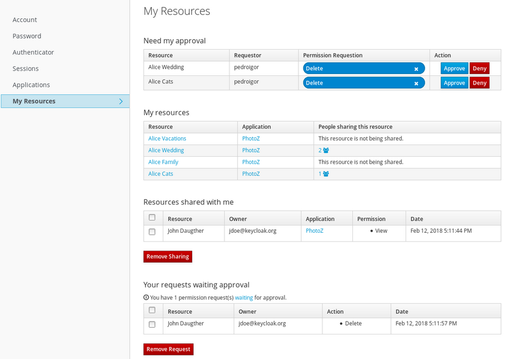

No menu do lado esquerdo, a opção Meus Recursos leva a uma página onde os
usuários podem:

-   Gerenciar pedidos de permissão que **precisam da minha aprovação**

>   Esta seção contém uma lista de todos os pedidos de permissão aguardando
>   aprovação. Essas solicitações estão conectadas às partes (usuários)
>   solicitando acesso a um determinado recurso. Os usuários podem aprovar ou
>   negar essas solicitações.

-   Gerencie **meus recursos**

>   Esta seção contém uma lista de todos os recursos de propriedade do usuário.
>   Os usuários podem clicar em um recurso para obter mais detalhes e
>   compartilhar o recurso com outros.

-   Gerenciar **recursos compartilhados comigo**

>   Esta seção contém uma lista de todos os recursos compartilhados com o
>   usuário.

-   Gerencie **seus pedidos de aprovação de espera**

>   Esta seção contém uma lista de solicitações de permissão enviadas pelo
>   usuário que estão aguardando a aprovação de outro usuário ou proprietário de
>   recursos.

Quando o usuário opta por detalhar a própria de seus recursos clicando em
qualquer recurso na listagem "Meus recursos", ele é redirecionado para uma
página da seguinte forma:

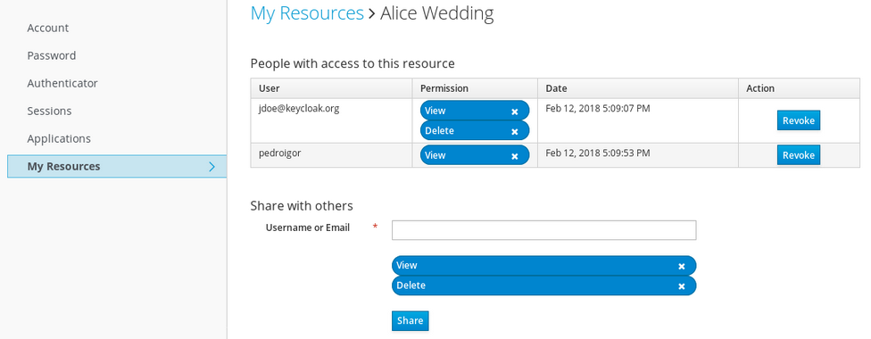

A partir desta página os usuários são capazes de:

-   Gerencie **pessoas com acesso a esse recurso**

>   Esta seção contém uma lista de pessoas com acesso a este recurso. Os
>   usuários podem revogar o acesso clicando no botão Revogar ou removendo uma
>   permissãoespecífica.

-   Compartilhe o recurso com outros

>   Ao digitar o nome de usuário ou e-mail de outro usuário, o usuário é capaz
>   de compartilhar o recurso e selecionar as permissões que deseja conceder
>   acesso.

API de proteção

A API de proteção fornece um conjunto de pontos finais compatíveis com UMA que
fornece:

-   **gestão de recursos**

>   Com esse ponto final, os servidores de recursos podem gerenciar seus
>   recursos remotamente e permitir que [os executores de
>   políticas](https://www.keycloak.org/docs/latest/authorization_services/index.html#_enforcer_overview)
>   consultem o servidor para os recursos que precisam de proteção.

-   **Gerenciamento de permissões**

>   No protocolo UMA, os servidores de recursos acessam este ponto final para
>   criar tickets de permissão. O Keycloak também fornece pontos finais para
>   gerenciar o estado de permissões e permissões de consulta.

-   **API política**

>   O Keycloak aproveita a API de proteção uma para permitir que os servidores
>   de recursos gerenciem permissões para seus usuários. Além das APIs de
>   recursos e permissões, o Keycloak fornece uma API de política de onde as
>   permissões podem ser definidas para recursos por servidores de recursos em
>   nome de seus usuários.

Um requisito importante para esta API é que *apenas* servidores de recursos
podem acessar seus pontos finais usando um token especial de acesso OAuth2
chamado token de API de proteção (PAT). Em UMA, um PAT é um token com o escopo
**uma_protection**.

O que é um PAT e Como Obtê-lo

Um **token de API** de proteção (PAT) é um token especial de acesso OAuth2 com
um escopo definido como **uma_protection**. Quando você cria um servidor de
recursos, o Keycloak cria automaticamente uma função, *uma_protection*, para o
aplicativo correspondente do clientee associa-o à conta de serviço do cliente.

Conta de serviço concedida com **uma_protection** função

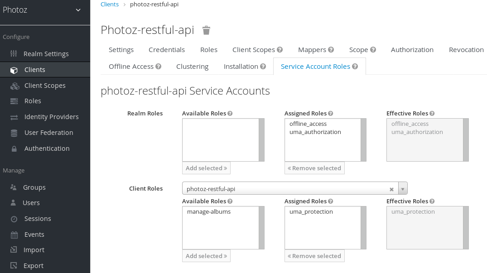

Os servidores de recursos podem obter um PAT do Keycloak como qualquer outro
token de acesso OAuth2. Por exemplo, usando enrolar:

curl -X POST \\

\-H "Tipo de conteúdo: aplicativo/x-www-form-urlencoded" \\

\-d
'grant_type=client_credentials&client_id=\${client_id}&client_secret=\${client_secret}'
\\

"http://localhost:8080/auth/realms/\${realm_name}/protocolo/openid-connect/token"

O exemplo acima é usar o **tipo de subvenção client_credentials** para obter um
PAT do servidor. Como resultado, o servidor retorna uma resposta semelhante à
seguinte:

{

"access_token": \${PAT},

" expires_in": 300,

" refresh_expires_in": 1800,

"refresh_token": \${refresh_token},

"token_type": "portador",

"id_token": \${id_token},

"não-antes-política": 0,

"session_state": "ccea4a55-9aec-4024-b11c-44f6f168439e"

}

|   | O Keycloak pode autenticar sua aplicação de cliente de diferentes maneiras. Para simplificar, o **tipo de** subvenção client_credentials é usado aqui, o que requer um *client_id* e um *client_secret*. Você pode optar por usar qualquer método de autenticação suportado. |
|---|------------------------------------------------------------------------------------------------------------------------------------------------------------------------------------------------------------------------------------------------------------------------------|

Gerenciamento de recursos

Os servidores de recursos podem gerenciar seus recursos remotamente usando um
ponto final compatível com UMA.

http://\${host}:\${port}/auth/realms/\${realm_name}/authz/protection/resource_set

Este ponto final fornece operações descritas da seguinte forma (caminho inteiro
omitido para clareza):

-   Criar descrição do conjunto de recursos: POST /resource_set

-   Leia a descrição do conjunto de recursos: GET /resource_set/{_id}

-   Descrição do conjunto de recursos de atualização: PUT /resource_set/{_id}

-   Excluir descrição do conjunto de recursos: DELETE /resource_set/{_id}

-   Listar descrições de conjuntos de recursos: GET /resource_set

Para obter mais informações sobre o contrato para cada uma dessas operações,
consulte [uma API de Registro de
Recursos](https://docs.kantarainitiative.org/uma/wg/oauth-uma-federated-authz-2.0-09.html#reg-api).

Criando um recurso

Para criar um recurso, você deve enviar uma solicitação HTTP POST da seguinte
forma:

curl -v -X POST \\

http://\${host}:\${port}/auth/realms/\${realm_name}/authz/protection/resource_set
\\

\-H 'Autorização: Portador '\$pat \\

\-H 'Tipo de conteúdo: aplicação/json' \\

\-d '{

"nome":"Serviço Social Tweedl",

"tipo":"http://www.example.com/rsrcs/socialstream/140-compatible",

"icon_uri":"http://www.example.com/icons/sharesocial.png",

"resource_scopes":[

"leia-público",

"pós-atualizações",

"leia-privado",

"http://www.example.com/scopes/all"

]

}'

Por padrão, o proprietário de um recurso é o servidor de recursos. Se você
quiser definir um proprietário diferente, como um usuário específico, você pode
enviar uma solicitação da seguinte forma:

curl -v -X POST \\

http://\${host}:\${port}/auth/realms/\${realm_name}/authz/protection/resource_set
\\

\-H 'Autorização: Portador '\$pat \\

\-H 'Tipo de conteúdo: aplicação/json' \\

\-d '{

"Nome":"Alice Resource",

"dona": "alice"

}'

Onde o proprietário do imóvel pode ser definido com o nome de usuário ou o
identificador do usuário.

Criando recursos gerenciados pelo usuário

Por padrão, os recursos criados via API de proteção não podem ser gerenciados
pelos proprietários de recursos através do [Serviço de
Conta](https://www.keycloak.org/docs/latest/authorization_services/index.html#_service_authorization_my_resources)do
Usuário.

Para criar recursos e permitir que os proprietários de recursos gerenciem esses
recursos, você deve definir a propriedade ownerManagedAccess da seguinte forma:

curl -v -X POST \\

http://\${host}:\${port}/auth/realms/\${realm_name}/authz/protection/resource_set
\\

\-H 'Autorização: Portador '\$pat \\

\-H 'Tipo de conteúdo: aplicação/json' \\

\-d '{

"Nome":"Alice Resource",

"dona": "alice",

"ownerManagedAccess": verdadeiro

}'

Atualizando recursos

Para atualizar um recurso existente, envie uma solicitação HTTP PUT da seguinte
forma:

curl -v -X PUT \\

http://\${host}:\${port}/auth/realms/\${realm_name}/authz/protection/resource_set/{resource_id}
\\

\-H 'Autorização: Portador '\$pat \\

\-H 'Tipo de conteúdo: aplicação/json' \\

\-d '{

"_id": "Alice Resource",

"Nome":"Alice Resource",

"resource_scopes":

"ler"

]

}'

Excluindo recursos

Para excluir um recurso existente, envie uma solicitação HTTP DELETE da seguinte
forma:

curl -v -X DELETE \\

http://\${host}:\${port}/auth/realms/\${realm_name}/authz/protection/resource_set/{resource_id}
\\

\-H 'Autorização: Portador '\$pat

Consultando recursos

Para consultar os recursos por id,envie uma solicitação HTTP GET da seguinte
forma:

http://\${host}:\${port}/auth/realms/\${realm_name}/authz/protection/resource_set/{resource_id}

Para consultar recursos com nomedado, envie uma solicitação HTTP GET da seguinte
forma:

http://\${host}:\${port}/auth/realms/\${realm_name}/authz/protection/resource_set?name=Alice
Resource

Por padrão, o filtro de nome corresponderá a qualquer recurso com o padrão dado.
Para restringir a consulta apenas para retornar recursos com uma correspondência
exata, use:

http://\${host}:\${port}/auth/realms/\${realm_name}/authz/protection/resource_set?name=Alice
Resource&exactName=true

Para consultar os recursos fornecidos a um uri,envie uma solicitação HTTP GET da
seguinte forma:

http://\${host}:\${port}/auth/realms/\${realm_name}/authz/protection/resource_set?uri=/api/alice

Para consultar os recursos dado a um proprietário,envie uma solicitação HTTP GET
da seguinte forma:

http://\${host}:\${port}/auth/realms/\${realm_name}/authz/protection/resource_set?owner=alice

Para consultar recursos dado a um tipo,envie uma solicitação HTTP GET da
seguinte forma:

http://\${host}:\${port}/auth/realms/\${realm_name}/authz/protection/resource_set?type=albums

Para consultar recursos com um escopo,envie uma solicitação HTTP GET da seguinte
forma:

http://\${host}:\${port}/auth/realms/\${realm_name}/authz/protection/resource_set?scope=read

Ao consultar o servidor para permissões use os parâmetros primeiro e os
resultados máximos para limitar o resultado.

Gerenciamento de solicitações de permissão

Os servidores de recursos que usam o protocolo UMA podem usar um ponto final
específico para gerenciar solicitações de permissão. Este ponto final fornece um
fluxo compatível com uma para registrar solicitações de permissão e obter um
bilhete de permissão.

http://\${host}:\${port}/auth/realms/\${realm_name}/authz/protection/permission

Um [bilhete de
permissão](https://www.keycloak.org/docs/latest/authorization_services/index.html#_overview_terminology_permission_ticket)
é um tipo de token de segurança especial que representa uma solicitação de
permissão. De acordo com a especificação UMA, um bilhete de permissão é:

Uma alça de correlação que é transmitida de um servidor de autorização para um
servidor de recursos, de um servidor de recursos para um cliente, e, finalmente,
de um cliente de volta a um servidor de autorização, para permitir que o
servidor de autorização avalie as políticas corretas para aplicar a uma
solicitação de dados de autorização.

Na maioria dos casos, você não precisará lidar diretamente com esse ponto final.
O Keycloak fornece um [executor de
políticas](https://www.keycloak.org/docs/latest/authorization_services/index.html#_enforcer_overview)
que permite uma para o seu servidor de recursos para que ele possa obter um
bilhete de permissão do servidor de autorização, devolver este bilhete ao
aplicativo do cliente e impor decisões de autorização com base em um token de
parte solicitante final (RPT).

O processo de obtenção de tickets de permissão da Keycloak é realizado por
servidores de recursos e não por aplicativos regulares de clientes, onde os
bilhetes de permissão são obtidos quando um cliente tenta acessar um recurso
protegido sem as subvenções necessárias para acessar o recurso. A emissão de
tickets de permissão é um aspecto importante ao usar uma, pois permite que os
servidores de recursos:

-   Resumo dos clientes os dados associados aos recursos protegidos pelo
    servidor de recursos

-   Registre-se nas solicitações de autorização keycloak que, por sua vez, podem
    ser usadas posteriormente em fluxos de trabalho para conceder acesso com
    base no consentimento do proprietário do recurso

-   Desvincular servidores de recursos de servidores de autorização e permitir
    que eles protejam e gerenciem seus recursos usando diferentes servidores de
    autorização

Sábio para o cliente, um bilhete de permissão também tem aspectos importantes
que é digno de destacar:

-   Os clientes não precisam saber como os dados de autorização estão associados
    a recursos protegidos. Um bilhete de permissão é completamente opaco para os
    clientes.

-   Os clientes podem ter acesso a recursos em diferentes servidores de recursos
    e protegidos por diferentes servidores de autorização

Estes são apenas alguns dos benefícios trazidos pela UMA, onde outros aspectos
da UMA são fortemente baseados em bilhetes de permissão, especialmente no que
diz respeito à privacidade e ao acesso controlado pelo usuário aos seus
recursos.

Criando bilhete de permissão

Para criar um bilhete de permissão, envie uma solicitação HTTP POST da seguinte
forma:

curl -X POST \\

http://\${host}:\${port}/auth/realms/\${realm_name}/authz/protection/permission
\\

\-H 'Autorização: Portador '\$pat \\

\-H 'Tipo de conteúdo: aplicação/json' \\

\-d '[

{

"resource_id": "{resource_id}",

"resource_scopes":

"vista"

]

}

]'

Ao criar bilhetes, você também pode empurrar reivindicações arbitrárias e
associar essas reivindicações com o bilhete:

curl -X POST \\

http://\${host}:\${port}/auth/realms/\${realm_name}/authz/protection/permission
\\

\-H 'Autorização: Portador '\$pat \\

\-H 'Tipo de conteúdo: aplicação/json' \\

\-d '[

{

"resource_id": "{resource_id}",

"resource_scopes":

"vista"

],

"reivindicações": {

"organização": ["acme"]

}

}

]'

Onde essas reivindicações estarão disponíveis para suas políticas ao avaliar
permissões para os recursos e escopos associados ao ticket de permissão.

Outros pontos finais não compatíveis com UMA

Criando bilhete de permissão

Para conceder permissões para um recurso específico com id {resource_id} a um
usuário com id {user_id}, como proprietário do recurso envie uma solicitação
HTTP POST da seguinte forma:

curl -X POST \\

http://\${host}:\${port}/auth/realms/\${realm_name}/authz/protection/permission/ticket
\\

\-H 'Autorização: Portador '\$access_token \\

\-H 'Tipo de conteúdo: aplicação/json' \\

\-d '{

"recurso": "{resource_id}",

"requester": "{user_id}",

"concedido": verdade,

"escopoNono": "visualização"

}'

Obtendo bilhetes de permissão

enrolar
http://\${host}:\${port}/auth/realms/\${realm_name}/authz/protection/permission/ticket
\\

\-H 'Autorização: Portador '\$access_token

Você pode usar qualquer um desses parâmetros de consulta:

-   escopoId

-   resourceId

-   proprietário

-   Solicitante

-   concedido

-   retornoOs nomes

-   primeiro

-   Max

Atualizar o bilhete de permissão

curl -X PUT \\

http://\${host}:\${port}/auth/realms/\${realm_name}/authz/protection/permission/ticket
\\

\-H 'Autorização: Portador '\$access_token \\

\-H 'Tipo de conteúdo: aplicação/json' \\

\-d '{

"id": "{ticket_id}"

"recurso": "{resource_id}",

"requester": "{user_id}",

"concedido": falso,

"escopoNono": "visualização"

}'

Exclusão do bilhete de permissão

curl -X DELETE
http://\${host}:\${port}/auth/realms/\${realm_name}/authz/protection/permission/ticket/{ticket_id}
\\

\-H 'Autorização: Portador '\$access_token

Gerenciamento de permissões de recursos usando a API de política

O Keycloak aproveita a API de proteção uma para permitir que os servidores de
recursos gerenciem permissões para seus usuários. Além das APIs de recursos e
permissões, o Keycloak fornece uma API de política de onde as permissões podem
ser definidas para recursos por servidores de recursos em nome de seus usuários.

A API de Política está disponível em:

http://\${host}:\${port}/auth/realms/\${realm_name}/authz/protection/uma-policy/{resource_id}

Esta API é protegida por um token portador que deve representar um consentimento
concedido pelo usuário ao servidor de recursos para gerenciar permissões em seu
nome. O token portador pode ser um token de acesso regular obtido a partir do
ponto final do token usando:

-   Tipo de concessão de credenciais de senha do proprietário do recurso

-   Token Exchange, a fim de trocar um token de acesso concedido a algum cliente
    (cliente público) por um token onde o público é o servidor de recursos

Associando uma Permissão a um recurso

Para associar uma permissão a um recurso específico, você deve enviar uma
solicitação HTTP POST da seguinte forma:

curl -X POST \\

http://localhost:8180/auth/realms/photoz/authz/protection/uma-policy/{resource_id}
\\

\-H 'Autorização: Portador '\$access_token \\

\-H 'Cache-Control: no-cache' \\

\-H 'Tipo de conteúdo: aplicação/json' \\

\-d '{

"Nome": "Qualquer gerente de pessoas",

"descrição": "Permitir o acesso a qualquer gerente de pessoas",

"escopos": ["leia"],

"papéis": ["people-manager"]

}'

No exemplo acima, estamos criando e associando uma nova permissão a um recurso
representado por resource_id onde qualquer usuário com uma função de gerente de
pessoas deve ser concedido com o escopo de leitura.

Você também pode criar políticas usando outros mecanismos de controle de acesso,
como o uso de grupos:

curl -X POST \\

http://localhost:8180/auth/realms/photoz/authz/protection/uma-policy/{resource_id}
\\

\-H 'Autorização: Portador '\$access_token \\

\-H 'Cache-Control: no-cache' \\

\-H 'Tipo de conteúdo: aplicação/json' \\

\-d '{

"Nome": "Qualquer gerente de pessoas",

"descrição": "Permitir o acesso a qualquer gerente de pessoas",

"escopos": ["leia"],

"grupos": ["/Gerentes/Gerentes de Pessoas"]

}'

Ou um cliente específico:

curl -X POST \\

http://localhost:8180/auth/realms/photoz/authz/protection/uma-policy/{resource_id}
\\

\-H 'Autorização: Portador '\$access_token \\

\-H 'Cache-Control: no-cache' \\

\-H 'Tipo de conteúdo: aplicação/json' \\

\-d '{

"Nome": "Qualquer gerente de pessoas",

"descrição": "Permitir o acesso a qualquer gerente de pessoas",

"escopos": ["leia"],

"clientes": ["meu cliente"]

}'

Ou mesmo usando uma política personalizada usando JavaScript:

|   | Upload Scripts é **Preterido** e será removido em versões futuras. Esse recurso é desativado por padrão. Para ativar iniciar o servidor com -Dkeycloak.profile.feature.upload_scripts=ativado . Para obter mais detalhes, consulte [Perfis](https://www.keycloak.org/docs/latest/server_installation/#profiles). |
|---|------------------------------------------------------------------------------------------------------------------------------------------------------------------------------------------------------------------------------------------------------------------------------------------------------------------|

curl -X POST \\

http://localhost:8180/auth/realms/photoz/authz/protection/uma-policy/{resource_id}
\\

\-H 'Autorização: Portador '\$access_token \\

\-H 'Cache-Control: no-cache' \\

\-H 'Tipo de conteúdo: aplicação/json' \\

\-d '{

"Nome": "Qualquer gerente de pessoas",

"descrição": "Permitir o acesso a qualquer gerente de pessoas",

"escopos": ["leia"],

"condição": "se (isPeopleManager()) {\$evaluation.grant()}"

}'

Também é possível definir qualquer combinação desses mecanismos de controle de
acesso.

Para atualizar uma permissão existente, envie uma solicitação HTTP PUT da
seguinte forma:

curl -X PUT \\

http://localhost:8180/auth/realms/photoz/authz/protection/uma-policy/{permission_id}
\\

\-H 'Autorização: Portador '\$access_token \\

\-H 'Tipo de conteúdo: aplicação/json' \\

\-d '{

"id": "21eb3fed-02d7-4b5a-9102-29f3f09b6de2",

"Nome": "Qualquer gerente de pessoas",

"descrição": "Permitir o acesso a qualquer gerente de pessoas",

"type": "uma",

"escopos": [

"álbum:view"

],

"lógica": "POSITIVO",

"DecisionStrategy": "UNÂNIME",

"proprietário": "7e22131a-aa57-4f5f-b1db-6e82babcd322",

"papéis": [

"usuário"

]

}'

Removendo uma permissão

Para remover uma permissão associada a um recurso, envie uma solicitação HTTP
DELETE da seguinte forma:

enrolar -X DELETE \\

http://localhost:8180/auth/realms/photoz/authz/protection/uma-policy/{permission_id}
\\

\-H 'Autorização: Portador '\$access_token

Permissão de consulta

Para consultar as permissões associadas a um recurso, envie uma solicitação HTTP
GET da seguinte forma:

http://\${host}:\${port}/auth/realms/\${realm}/authz/protection/uma-policy?resource={resource_id}

Para consultar as permissões com seu nome, envie uma solicitação HTTP GET da
seguinte forma:

http://\${host}:\${port}/auth/realms/\${realm}/authz/protection/uma-policy?name=Qualquer
gerente de pessoas

Para consultar as permissões associadas a um escopo específico, envie uma
solicitação HTTP GET da seguinte forma:

http://\${host}:\${port}/auth/realms/\${realm}/authz/protection/uma-policy?scope=read
read

Para consultar todas as permissões, envie uma solicitação HTTP GET da seguinte
forma:

http://\${host}:\${port}/auth/realms/\${realm}/authz/protection/uma-policy

Ao consultar o servidor para permissões use os parâmetros primeiro e os
resultados máximos para limitar o resultado.

Solicitando token de festa

Um token de festa solicitante (RPT) é um [token web JSON
(JWT)](https://datatracker.ietf.org/doc/html/rfc7519) assinado digitalmente
usando a assinatura web [JSON
(JWS)](https://datatracker.ietf.org/doc/html/rfc7515). O token é construído com
base no token de acesso OAuth2 anteriormente emitido pela Keycloak a um cliente
específico agindo em nome de um usuário ou em seu próprio nome.

Quando você decodifica um RPT, você vê uma carga semelhante à seguinte:

{

"autorização":{

"permissões":[

{

"resource_set_id": "d2fe9843-6462-4bfc-baba-b5787bb6e07"

"resource_set_name": "Hello World Resource"

}

]

},

"jti": "d6109a09-78fd-4998-bf89-95730dfd0892-1464906679405",

"exp": 1464906971,

"nbf": 0,

"iat": 1464906671,

"sub": "f1888f4d-5172-4359-be0c-af338505d86c"

"tipo"" : "kc_ett",

"azp": "hello-world-authz-service"

}

A partir deste token você pode obter todas as permissões concedidas pelo
servidor a partir da solicitação de **permissões.**

Observe também que as permissões estão diretamente relacionadas com os
recursos/escopos que você está protegendo e completamente dissociadas dos
métodos de controle de acesso que foram usados para realmente conceder e emitir
essas mesmas permissões.

Introspecção de um token de parte solicitante

Às vezes, você pode querer introspectar um token de parte solicitante (RPT) para
verificar sua validade ou obter as permissões dentro do token para impor
decisões de autorização no lado do servidor de recursos.

Existem dois casos principais de uso em que a introspecção de token pode
ajudá-lo:

-   Quando os aplicativos do cliente precisam consultar a validade do token para
    obter um novo com as mesmas permissões adicionais

-   Ao impor decisões de autorização no lado do servidor de recursos,
    especialmente quando nenhum dos [executores de políticas
    incorporados](https://www.keycloak.org/docs/latest/authorization_services/index.html#_enforcer_overview)
    se encaixa no seu aplicativo

Obtendo informações sobre um RPT

A introspecção do token é essencialmente um ponto final compatível com
introspecção de [token OAuth2](https://datatracker.ietf.org/doc/html/rfc7662)do
qual você pode obter informações sobre um RPT.

http://\${host}:\${port}/auth/realms/\${realm_name}/protocol/openid-connect/token/introspect

Para introspecr um RPT usando este ponto final, você pode enviar uma solicitação
para o servidor da seguinte forma:

curl -X POST \\

\-H "Autorização: AGVsbG8td29ybGQtYXV0aHotc2VydmljZTpzZWNyZXQ=" \\

\-H "Tipo de conteúdo: aplicativo/x-www-form-urlencoded" \\

\-d 'token_type_hint=requesting_party_token&token=\${RPT}' \\

"http://localhost:8080/auth/realms/hello-world-authz/protocol/openid-connect/token/introspect"

|   | A solicitação acima é usar o HTTP BASIC e passar as credenciais do cliente (ID do cliente e segredo) para autenticar o cliente tentando introspectar o token, mas você pode usar qualquer outro método de autenticação do cliente suportado pelo Keycloak. |
|---|------------------------------------------------------------------------------------------------------------------------------------------------------------------------------------------------------------------------------------------------------------|

O ponto final de introspecção espera dois parâmetros:

-   **token_type_hint**

>   Use **requesting_party_token** como o valor deste parâmetro, o que indica
>   que você deseja introspectar um RPT.

-   **símbolo**

>   Use a sequência de tokens como ela foi devolvida pelo servidor durante o
>   processo de autorização como o valor para este parâmetro.

Como resultado, a resposta do servidor é:

{

"permissões":[

{

"resource_id": "90ccc6fc-b296-4cd1-881e-089e1ee15957"

"resource_name": "Hello World Resource"

}

],

"exp": 1465314139,

"nbf": 0,

"iat": 1465313839,

"aud": "hello-world-authz-service",

"ativo": verdadeiro

}

Se o RPT não estiver ativo, essa resposta será devolvida em vez disso:

{

"ativo": falso

}

Preciso invocar o servidor toda vez que eu quiser introspectar um RPT?

Não. Assim como um token de acesso regular emitido por um servidor Keycloak, os
RPTs também usam a especificação [JSON web token
(JWT)](https://datatracker.ietf.org/doc/html/rfc7519) como o formato padrão.

Se você quiser validar esses tokens sem uma chamada para o ponto final de
introspecção remota, você pode decodificar o RPT e consultar sua validade
localmente. Uma vez que você decodificar o token, você também pode usar as
permissões dentro do token para impor decisões de autorização.

Isto é essencialmente o que [os executores da
política](https://www.keycloak.org/docs/latest/authorization_services/index.html#_enforcer_overview)
fazem.

-   Validar a assinatura do RPT (com base na chave pública do reino)

-   Consulta para validade de token com base em suas alegações *exp, iat*e *aud*

API Java cliente de autorização

Dependendo de seus requisitos, um servidor de recursos deve ser capaz de
gerenciar recursos remotamente ou até mesmo verificar permissões programáticas.
Se você estiver usando Java, você pode acessar os Serviços de Autorização
keycloak usando a API do Cliente de Autorização.

Ele é direcionado para servidores de recursos que desejam acessar os diferentes
pontos finais fornecidos pelo servidor, como os pontos finais de gerenciamento
de Token Endpoint, Resource e Permission.

Dependência Maven

\<dependências\>

\<dependência\>

\<groupId\>org.keycloak\</groupId\>

\<artifactId\>keycloak-authz-cliente\</artifactId\>

\<versão\>\${KEYCLOAK_VERSION}\</versão\>

\</dependência\>

\</dependências\>

configuração

A configuração do cliente é definida em um arquivo keycloak.json da seguinte
forma:

{

"reino": "hello-world-authz",

"auth-server-url" : "http://localhost:8080/auth",

"recurso" : "hello-world-authz-service",

"credenciais":{

"secreto": "segredo"

}

}

-   **reino** (obrigatório)

>   O nome do reino.

-   **auth-server-url** (necessário)

>   A URL base do servidor Keycloak. Todas as outras páginas keycloak e pontos
>   finais de serviço REST são derivados disso. Geralmente está no formulário
>   [https://host:port/auth](http://09B14E82C609909A18AF2F3A1ED8EBC14ED5E0D4/https%3A%2F%2Fhost%3Aport%2Fauth).

-   **recurso** (obrigatório)

>   A id do cliente da aplicação. Cada aplicativo tem um id do cliente que é
>   usado para identificar o aplicativo.

-   **credenciais** (necessárias)

>   Especifica as credenciais do aplicativo. Esta é uma notação de objeto onde a
>   chave é o tipo de credencial e o valor é o valor do tipo credencial.

O arquivo de configuração geralmente está localizado no classpath do seu
aplicativo, o local padrão de onde o cliente vai tentar encontrar um arquivo
keycloak.json.

Criando o Cliente de Autorização

Considerando que você tem um arquivo keycloak.json em seu classpath, você pode
criar uma nova instância AuthzClient da seguinte forma:

*criar uma nova instância com base na configuração definida em um keycloak.json
localizado em seu classpath*

AuthzClient authzClient = AuthzClient.create();

Obtenção de direitos do usuário

Aqui está um exemplo que ilustra como obter direitos de usuário:

*criar uma nova instância com base na configuração definida em keycloak.json*

AuthzClient authzClient = AuthzClient.create();

*criar uma solicitação de autorização*

Solicitação de solicitação de solicitação de autorização = **novo** Pedido de
Autorização();

*enviar a solicitação de direito para o servidor, a fim de*

*obter um RPT com todas as permissões concedidas ao usuário*

AutorizaçãoPonse resposta = authzClient.authorization("alice",
"alice"(solicitação);

String rpt = response.getToken();

System.out.println("Você tem um RPT: " + rpt);

*agora você pode usar o RPT para acessar recursos protegidos no servidor de
recursos*

Aqui está um exemplo que ilustra como obter direitos do usuário para um conjunto
de um ou mais recursos:

*criar uma nova instância com base na configuração definida em keycloak.json*

AuthzClient authzClient = AuthzClient.create();

*criar uma solicitação de autorização*

Solicitação de solicitação de solicitação de autorização = **novo** Pedido de
Autorização();

*adicionar permissões à solicitação com base nos recursos e escopos que você
deseja verificar o acesso*

request.addPermission("RecursoPadrão");

*enviar a solicitação de direito para o servidor, a fim de*

*obter um RPT com permissões para um único recurso*

AutorizaçãoPonse resposta = authzClient.authorization("alice",
"alice"(solicitação);

String rpt = response.getToken();

System.out.println("Você tem um RPT: " + rpt);

*agora você pode usar o RPT para acessar recursos protegidos no servidor de
recursos*

Criando um recurso usando a API de proteção

*criar uma nova instância com base na configuração definida em keycloak.json*

AuthzClient authzClient = AuthzClient.create();

*criar uma nova representação de recursos com as informações que queremos*

NovaRepresentação de Recursos = **nova** Representação de Recursos();

newResource.setName("Novo Recurso");

newResource.setType("urn:hello-world-authz:resources:example");

newResource.addScope(nova Representação de
Escopo("urn:hello-world-authz:scopes:view"));

Recursos de recurso protegidosCient = authzClient.protection().resource();

RecursoRepresentação existenteResource =
resourceClient.findByName(newResource.getName());

**se** (existenteResource != nulo){

resourceClient.delete (existenteResource.getId());

}

*criar o recurso no servidor*

Resposta de representação de recursos = resourceClient.create(newResource);

Recurso de stringId = response.getId();

*consultar o recurso usando seu id recém-gerado*

Recurso de representação de recursos = resourceClient.findById(resourceId);

System.out.println(recurso);

Introspecção de um RPT

*criar uma nova instância com base na configuração definida em keycloak.json*

AuthzClient authzClient = AuthzClient.create();

*enviar a solicitação de autorização para o servidor, a fim de*

*obter um RPT com todas as permissões concedidas ao usuário*

AutorizaçãoResponse resposta = authzClient.authorization("alice",
"alice".autorizar();

String rpt = response.getToken();

*introspectar o token*

TokenIntrospectionResponse solicitandoPartyToken =
authzClient.protection().introspectRequestingPartyToken(rpt);

System.out.println("Status do token é: " + solicitandoPartyToken.getActive());

System.out.println("Permissões concedidas pelo servidor: ";

(Permissão concedida : solicitandoPartyToken.getPermissions()) {

System.out.println (concedido);

}

Executores de Políticas

Policy Enforcement Point (PEP) é um padrão de design e, como tal, você pode
implementá-lo de diferentes maneiras. O Keycloak fornece todos os meios
necessários para implementar PEPs para diferentes plataformas, ambientes e
linguagens de programação. O Keycloak Authorization Services apresenta uma API
RESTful e aproveita os recursos de autorização do OAuth2 para autorização de
grãos finos usando um servidor de autorização centralizado.

A PEP é responsável por impor decisões de acesso do servidor Keycloak onde essas
decisões são tomadas avaliando as políticas associadas a um recurso protegido.
Ele atua como um filtro ou interceptor em seu aplicativo, a fim de verificar se
uma solicitação específica a um recurso protegido pode ou não ser cumprida com
base nas permissões concedidas por essas decisões.

As permissões são aplicadas dependendo do protocolo que você está usando. Ao
usar uma, o executor da apólice sempre espera um RPT como um token portador, a
fim de decidir se uma solicitação pode ou não ser atendida. Isso significa que
os clientes devem primeiro obter um RPT da Keycloak antes de enviar solicitações
para o servidor de recursos.

No entanto, se você não estiver usando uma, você também pode enviar tokens de
acesso regular para o servidor de recursos. Neste caso, o executor da política
tentará obter permissões diretamente do servidor.

Se você estiver usando qualquer um dos adaptadores Keycloak OIDC, você pode
facilmente habilitar o executor de políticas adicionando a seguinte propriedade
ao seu arquivo **keycloak.json:**

keycloak.json

{

"policy-enforcer"{}

}

Quando você habilitar o executor da apólice, todas as solicitações enviadas pelo
aplicativo serão interceptadas e o acesso a recursos protegidos será concedido
dependendo das permissões concedidas pela Keycloak à identidade que faz a
solicitação.

A aplicação da política está fortemente ligada aos caminhos do seu aplicativo e
aos
[recursos](https://www.keycloak.org/docs/latest/authorization_services/index.html#_resource_overview)
criados para um servidor de recursos usando o Console de Administração Keycloak.
Por padrão, quando você cria um servidor de recursos, o Keycloak cria uma
[configuração
padrão](https://www.keycloak.org/docs/latest/authorization_services/index.html#_resource_server_default_config)
para o servidor de recursos para que você possa habilitar a aplicação da
diretiva rapidamente.

configuração

Para habilitar a aplicação da política para o seu aplicativo, adicione a
seguinte propriedade ao seu arquivo **keycloak.json:**

keycloak.json

{

"policy-enforcer"{}

}

Ou um pouco mais de verbose se você quiser definir manualmente os recursos que
estão sendo protegidos:

{

"policy-enforcer":{

"acesso gerenciado pelo usuário" {},

"modo de execução" : "IMPOR",

"caminhos":[

{

"caminho" : "/someUri/\*",

"métodos" : [

{

"método": "GET",

"escopos" : ["urna:app.com:escopos:ver"]

},

{

"método": "POST",

"escopos" : ["urna:app.com:escopos:criar"]

}

]

},

{

"nome" : "Algum recurso",

"caminho" : "/usingPattern/{id}",

"métodos" : [

{

"método": "DELETE",

"escopos" : ["urna:app.com:escopos:delete"]

}

]

},

{

"caminho" : "/exactMatch"

},

{

"nome" : "Recursos administrativos",

"caminho" : "/usandoWildCards/\*"

}

]

}

}

Aqui está uma descrição de cada opção de configuração:

-   **executor de políticas**

>   Especifica as opções de configuração que definem como as políticas são
>   realmente aplicadas e, opcionalmente, os caminhos que você deseja proteger.
>   Se não especificado, o executor de políticas consulta o servidor para que
>   todos os recursos associados ao servidor de recursos sejam protegidos. Neste
>   caso, você precisa garantir que os recursos estejam configurados
>   corretamente com uma propriedade
>   [URIS](https://www.keycloak.org/docs/latest/authorization_services/index.html#_resource_create_uri)
>   que corresponda aos caminhos que você deseja proteger.

-   **acesso gerenciado pelo usuário**

>   Especifica que o adaptador usa o protocolo UMA. Se especificado, o adaptador
>   consulta o servidor para obter bilhetes de permissão e os devolve aos
>   clientes de acordo com a especificação UMA. Se não for especificado, o
>   executor de políticas poderá impor permissões com base em tokens de acesso
>   regulares ou RPTs. Neste caso, antes de negar o acesso ao recurso quando o
>   token não tiver permissão, o executor da política tentará obter permissões
>   diretamente do servidor.

-   **modo de execução**

>   Especifica como as políticas são aplicadas.

-   **Aplicação**

>   (modo padrão) Os pedidos são negados por padrão mesmo quando não há uma
>   política associada a um determinado recurso.

-   **permissivo**

>   As solicitações são permitidas mesmo quando não há uma política associada a
>   um determinado recurso.

-   **desactivado**

>   Desativa completamente a avaliação das políticas e permite o acesso a
>   qualquer recurso. Quando o modo de execução é, os aplicativos DESATIVADOs
>   ainda são capazes de obter todas as permissões concedidas pela Keycloak
>   através do Contexto de
>   [Autorização](https://www.keycloak.org/docs/latest/authorization_services/index.html#_enforcer_authorization_context)

-   **on-deny-redirecionar-to**

>   Define uma URL onde uma solicitação de cliente é redirecionada quando uma
>   mensagem de "acesso negado" é obtida do servidor. Por padrão, o adaptador
>   responde com um código de status HTTP de 403.

-   **path-cache**

>   Define como o executor de políticas deve rastrear associações entre caminhos
>   em sua aplicação e recursos definidos no Keycloak. O cache é necessário para
>   evitar solicitações desnecessárias a um servidor Keycloak, cedendo
>   associações entre caminhos e recursos protegidos.

-   **Vida útil**

>   Define o tempo em milissegundos quando a entrada deve expirar. Se não for
>   fornecido, o valor padrão é **30000**. Um valor igual a 0 pode ser definido
>   para desativar completamente o cache. Um valor igual a -1 pode ser definido
>   para desativar a expiração do cache.

-   **max-entradas**

>   Define o limite de entradas que devem ser mantidas no cache. Se não for
>   fornecido, o valor padrão é **de 1000**.

-   **Caminhos**

>   Especifica os caminhos para proteger. Esta configuração é opcional. Se não
>   for definido, o executor de políticas descobrirá todos os caminhos buscando
>   os recursos definidos para sua aplicação no Keycloak, onde esses recursos
>   são definidos com o URIS representando alguns caminhos em sua aplicação.

-   **nome**

>   O nome de um recurso no servidor que deve ser associado a um determinado
>   caminho. Quando usado em conjunto com um **caminho,**o executor de políticas
>   ignora a propriedade **URIS** do recurso e usa o caminho que você forneceu
>   em vez disso.

-   **caminho**

>   (obrigatório) Um URI em relação ao caminho de contexto da aplicação. Se essa
>   opção for especificada, o executor de políticas consulta o servidor para um
>   recurso com um **URI** com o mesmo valor. Atualmente, uma lógica muito
>   básica para a correspondência de caminhos é suportada. Exemplos de caminhos
>   válidos são:

-   Curingas: /\*

-   Sufixo: /\*.html

-   Sub-caminhos: /path/\*

-   Parâmetros do caminho: /resource/{id}

-   Correspondência exata: /recurso

-   Padrões: /{version}/recurso, /api/{version}/recurso,
    /api/{version}/recurso/\*

-   **Métodos**

>   Os métodos HTTP (por exemplo, GET, POST, PATCH) para proteger e como eles
>   estão associados aos escopos de um determinado recurso no servidor.

-   **método**

>   O nome do método HTTP.

-   **Escopos**

>   Uma série de strings com os escopos associados ao método. Quando você
>   associa escopos a um método específico, o cliente que tenta acessar um
>   recurso protegido (ou caminho) deve fornecer um RPT que conceda permissão a
>   todos os escopos especificados na lista. Por exemplo, se você definir um
>   *POST* método com uma *criação* de escopo, o RPT deve conter uma permissão
>   que conceda acesso ao escopo de *criação* ao executar um POST no caminho.

-   **escopos-modo de aplicação de aplicação**

>   Uma sequência referenciando o modo de aplicação para os escopos associados a
>   um método. Os valores podem ser **TODOS** ou **QUALQUER**. Se **ALL**,
>   todosos escopos definidos devem ser concedidos para acessar o recurso usando
>   esse método. Se **HOUVER**, pelo menos um escopo deve ser concedido para
>   obter acesso ao recurso usandoesse método. Por padrão, o modo de execução é
>   definido como **ALL**.

-   **modo de execução**

>   Especifica como as políticas são aplicadas.

-   **Aplicação**

>   (modo padrão) Os pedidos são negados por padrão mesmo quando não há uma
>   política associada a um determinado recurso.

-   **desactivado**

-   **ponto de reclamação-informação**

>   Define um conjunto de uma ou mais reivindicações que devem ser resolvidas e
>   empurradas para o servidor Keycloak, a fim de tornar essas reivindicações
>   disponíveis para políticas. Consulte [o Ponto de Informações de
>   Sinistro](https://www.keycloak.org/docs/latest/authorization_services/index.html#_enforcer_claim_information_point)
>   para obter mais detalhes.

-   **preguiçoso-carga-caminhos**

>   Especifica como o adaptador deve buscar o servidor para obter recursos
>   associados aos caminhos em seu aplicativo. Se **for verdade,**o executor da
>   política buscará recursos sob demanda em conformidade com o caminho que está
>   sendo solicitado. Essa configuração é especialmente útil quando você não
>   quer obter todos os recursos do servidor durante a implantação (caso você
>   não tenha fornecido caminhos ) ou no caso de você terdefinido apenas um
>   sub-conjunto de caminhos e quiser buscar outros sob demanda.

-   **http-método-como-escopo**

>   Especifica como os escopos devem ser mapeados para métodos HTTP. Se definido
>   **como verdadeiro,**o executor da política usará o método HTTP da
>   solicitação atual para verificar se o acesso deve ou não ser concedido.
>   Quando ativado, certifique-se de que seus recursos no Keycloak estejam
>   associados a escopos que representam cada método HTTP que você está
>   protegendo.

-   **ponto de reclamação-informação**

>   Define um conjunto de uma ou mais reivindicações **globais** que devem ser
>   resolvidas e empurradas para o servidor Keycloak, a fim de tornar essas
>   reivindicações disponíveis para políticas. Consulte [o Ponto de Informações
>   de
>   Sinistro](https://www.keycloak.org/docs/latest/authorization_services/index.html#_enforcer_claim_information_point)
>   para obter mais detalhes.

Ponto de informação de reclamação

Um CIP (Claim Information Point, ponto de informação de sinistro) é responsável
por resolver sinistros e levar essas reivindicações ao servidor Keycloak, a fim
de fornecer mais informações sobre o contexto de acesso às políticas. Eles podem
ser definidos como uma opção de configuração para o executor de políticas, a fim
de resolver reivindicações de diferentes fontes, tais como:

-   Http Request (parâmetros, cabeçalhos, corpo, etc)

-   Serviço HTTP externo

-   Valores estáticos definidos na configuração

-   Qualquer outra fonte implementando o SPI do Provedor de Informações de
    Sinistro

Ao empurrar reivindicações para o servidor Keycloak, as políticas podem basear
decisões não apenas sobre quem é um usuário, mas também levando em conta o
contexto e o conteúdo, com base em quem, o que, quando, onde e qual para uma
determinada transação. Trata-se de Autorização baseada em Contextual e como usar
informações de tempo de execução para apoiar decisões de autorização de grãos
finos.

Obtendo informações a partir do Pedido HTTP

Aqui estão vários exemplos mostrando como você pode extrair reclamações de uma
solicitação HTTP:

keycloak.json

"policy-enforcer":{

"caminhos":[

{

"caminho": "/protected/recurso",

"ponto de informação de reivindicação":{

"afirma"{{

"pedido de solicitação-parâmetro": "{request.parameter['a']}",

"reivindicação de cabeçalho": "{request.header['b']}",

"reivindicação de cookie": "{request.cookie['c']}"

"claim-from-remoteAddr": "{request.remoteAddr}"

"reivindicação-do-método": "{request.method}",

"reivindicação-from-uri": "{request.uri}",

"claim-from-relativePath": "{request.relativePath}"

"reivindicação-de-segurança": "{request.secure}",

"claim-from-json-body-object": "{request.body['/a/b/c'}"

"claim-from-json-body-array": "{request.body['/d/1'}"

"reivindicação do corpo": "{request.body}",

"valor de reivindicação-da-estática": "valor estático",

"reivindicação de valor multi-estático": ["estática", "valor"],

"param-substituir-espaço-lugar múltiplo": "Teste
{keycloak.access_token['/custom_claim/0']} e {request.parameter['a'}"

}

}

}

]

}

Obtendo informações de um serviço HTTP externo

Aqui estão vários exemplos mostrando como você pode extrair reclamações de um
serviço HTTP externo:

keycloak.json

"policy-enforcer":{

"caminhos":[

{

"caminho": "/protected/recurso",

"ponto de informação de reivindicação":{

"http":{

"afirma"{{

"reivindicação-a": "/a",

"claim-d": "/d",

"claim-d0": "/d/0",

"claim-d-all":["/d/0", "/d/1"]

},

"url": "http://mycompany/claim-provider",

"método": "POST",

"cabeçalhos":{

"Tipo de conteúdo": "aplicativo/x-www-form-urlencoded",

"cabeçalho-b":["header-b-value1", "header-b-value2"],

"Autorização": "Portador {keycloak.access_token}"

},

"parâmetros":{

"param-a": ["param-a-value1", "param-a-value2"],

"param-subject": "{keycloak.access_token['/sub']}",

"nome do usuário param": "{keycloak.access_token['/preferred_username'}"

"param-other-claims": "{keycloak.access_token['/custom_claim'}"

}

}

}

}

]

}

Alegações estáticas

keycloak.json

"policy-enforcer":{

"caminhos":[

{

"caminho": "/protected/recurso",

"ponto de informação de reivindicação":{

"afirma"{{

"valor de reivindicação-da-estática": "valor estático",

"reivindicação de valor multi-estático": ["estática", "valor"],

}

}

}

]

}

SPI do provedor de informações de sinistro

O SPI do Provedor de Informações de Sinistro pode ser usado pelos
desenvolvedores para suportar diferentes pontos de informações de sinistro no
caso de nenhum dos provedores incorporados ser suficiente para atender às suas
necessidades.

Por exemplo, para implementar um novo provedor CIP, você precisa implementar
org.keycloak.adapters.authorization.ClaimInformationPointProviderFactory e
ClaimInformationPointProvider e também fornecer o arquivo
META-INF/services/org.keycloak.adapters.authorization.ClaimInformationPointProviderFactory
na classpath do seu aplicativo.

Exemplo de
org.keycloak.adapters.authorization.ClaimInformationPointProviderFactory:

**classe pública MyClaimInformationPointProviderFactory implementa**
ClaimInformationPointProviderFactory\<MyClaimInformationPointProvider\> {

\@Override

**cadeia pública** getName() {

**devolver** "minhas reivindicações";

}

\@Override

**vazio público** init (PolicyEnforcer policyEnforcer) {

}

\@Override

**público** MyClaimInformationPointProvider create (Map\<String, Object\>
config) {

**retornar novo** MyClaimInformationPointProvider(config);

}

}

Todos os provedores CIP devem estar associados a um nome, conforme definido
acima no método MyClaimInformationPointProviderFactory.getName. O nome será
usado para mapear a configuração da seção de ponto de reclamação-informações na
configuração de executor de diretivas para a implementação.

Ao processar solicitações, o executor de políticas chamará o método
MyClaimInformationPointProviderFactory.create para obter uma instância do
MyClaimInformationPointProvider. Quando chamada, qualquer configuração definida
para este provedor CIP em particular (via ponto de solicitação-informações) é
passada como um mapa.

Exemplo de ClaimInformationPointProvider:

**classe pública MyClaimInformationPointProvider implementa**
ClaimInformationPointProvider {

**mapa final** privado\<String, objeto\> config;

Public ClaimsInformationPointProvider (Map\<String, Object\> config) {

este.config = config;

}

\@Override

mapa\<bante público, lista\<String\>\> resolve (HttpFacade httpFacade) {

Map\<String, List\<String\>\> claims = **novo** HashMap\<\>();

*colocar qualquer reivindicação que você quer no mapa*

**reivindicações de** retorno;

}

}

Obtenção do Contexto de Autorização

Quando a aplicação da política é ativada, as permissões obtidas no servidor
estão disponíveis através de org.keycloak.AuthorizationContext. Esta classe
fornece vários métodos que você pode usar para obter permissões e verificar se
uma permissão foi concedida para um determinado recurso ou escopo.

Obtenção do Contexto de Autorização em um Recipiente Servlet

HttpServletRequest request = ... *// obter
javax.servlet.http.HttpServletRequest*

KeycloakSecurityContext keycloakSecurityContext =

(KeycloakSecurityContext) solicitação

.getAttribute(KeycloakSecurityContext.class.getName());

AutorizaçãoContexto authzContext =

keycloakSecurityContext.getAuthorizationContext();

|   | Para obter mais detalhes sobre como você pode obter um KeycloakSecurityContext consulte a configuração do adaptador. O exemplo acima deve ser suficiente para obter o contexto ao executar um aplicativo usando qualquer um dos recipientes de servlet suportados pelo Keycloak. |
|---|----------------------------------------------------------------------------------------------------------------------------------------------------------------------------------------------------------------------------------------------------------------------------------|

O contexto de autorização ajuda a dar mais controle sobre as decisões tomadas e
devolvidas pelo servidor. Por exemplo, você pode usá-lo para construir um menu
dinâmico onde os itens estão ocultos ou mostrados dependendo das permissões
associadas a um recurso ou escopo.

**se** (authzContext.hasResourcePermission("Recurso do Projeto")) {

*usuário pode acessar o Recurso do Projeto*

}

**se** (authzContext.hasResourcePermission("Recursoadministrativo")) {

*usuário pode acessar recursos de administração*

}

**se** (authzContext.hasScopePermission("urn:project.com:project:create")) {

*usuário pode criar novos projetos*

}

O AuthorizationContext representa uma das principais capacidades dos Serviços de
Autorização Keycloak. A partir dos exemplos acima, você pode ver que o recurso
protegido não está diretamente associado às políticas que os governam.

Considere algum código semelhante usando o controle de acesso baseado em papel
(RBAC):

**se** (User.hasRole('usuário')) {

*usuário pode acessar o Recurso do Projeto*

}

**se** (User.hasRole('admin')) {

*usuário pode acessar recursos de administração*

}

**se** (User.hasRole('project-manager')) {

*usuário pode criar novos projetos*

}

Embora ambos os exemplos abdoem os mesmos requisitos, eles o fazem de maneiras
diferentes. Na RBAC, os papéis apenas definem *implicitamente* o acesso para
seus recursos. Com o Keycloak, você ganha a capacidade de criar um código mais
gerenciável que se concentra diretamente em seus recursos, quer você esteja
usando o RBAC, o controle de acesso baseado em atributos (ABAC) ou qualquer
outra variante BAC. Ou você tem a permissão para um determinado recurso ou
escopo, ou você não tem.

Agora, suponha que seus requisitos de segurança tenham mudado e, além dos
gerentes de projetos, os PMOs também podem criar novos projetos.

Os requisitos de segurança mudam, mas com o Keycloak não há necessidade de
alterar o código do aplicativo para atender aos novos requisitos. Uma vez que
seu aplicativo esteja baseado no identificador de recursos e escopo, você só
precisa alterar a configuração das permissões ou políticas associadas a um
recurso específico no servidor de autorização. Neste caso, as permissões e
políticas associadas ao Recurso do Projeto e/ou à urna de
escopo:project.com:project:create seriam alteradas.

Usando o Texto de Autorização para obter uma Instância de Cliente de Autorização

O AuthorizationContext também pode ser usado para obter uma referência à API [do
Cliente de
Autorização](https://www.keycloak.org/docs/latest/authorization_services/index.html#_service_client_api)
configurada ao seu aplicativo:

ClienteAuthorizaçãoContext clienteContext =
ClientAuthorizationContext.class.cast(authzContext);

AuthzClient authzClient = clientContext.getClient();

Em alguns casos, os servidores de recursos protegidos pelo executor da apólice
precisam acessar as APIs fornecidas pelo servidor de autorização. Com uma
instância AuthzClient em mãos, os servidores de recursos podem interagir com o
servidor a fim de criar recursos ou verificar se há permissões específicas
programáticas.

Integração JavaScript

O Keycloak Server vem com uma biblioteca JavaScript que você pode usar para
interagir com um servidor de recursos protegido por um executor de políticas.
Esta biblioteca é baseada no adaptador Keycloak JavaScript, que pode ser
integrado para permitir que seu cliente obtenha permissões de um Servidor
Keycloak.

Você pode obter esta biblioteca a partir de uma execução de uma instância do
Servidor Keycloak, incluindo a seguinte tag de script em sua página web:

\<script src="http://.../auth/js/keycloak-authz.js"\>\</script\>

Uma vez que você faz isso, você pode criar uma instância de Autororização
keycloak da seguinte forma:

**var** keycloak = ... *// obter uma instância keycloak da biblioteca
keycloak.js*

autorização do VAR = **nova** KeycloakAuthorization(keycloak);

A biblioteca **keycloak-authz.js** fornece duas características principais:

-   Obtenha permissões do servidor usando um bilhete de permissão, se você
    estiver acessando um servidor de recursos protegido uma.

-   Obtenha permissões do servidor enviando os recursos e escopos que o
    aplicativo deseja acessar.

Em ambos os casos, a biblioteca permite que você interaja facilmente com o
servidor de recursos e os Serviços de Autorização Keycloak para obter tokens com
permissões que seu cliente pode usar como tokens portadores para acessar os
recursos protegidos em um servidor de recursos.

Manipulação de respostas de autorização de um servidor de recursos protegido por
UMA

Se um servidor de recursos estiver protegido por um executor de políticas, ele
responderá às solicitações do cliente com base nas permissões realizadas junto
com um token portador. Normalmente, quando você tenta acessar um servidor de
recursos com um token portador que não tem permissões para acessar um recurso
protegido, o servidor de recursos responde com um código de status de **401** e
um cabeçalho WWW-Authenticate.

HTTP/1.1 401 Não Autorizado

WWW-Authenticate: UM realm="\${realm}",

as_uri="https://\${host}:\${port}/auth/realms/\${realm}",

ticket="016f84e8-f9b9-11e0-bd6f-0021cc6004de"

Consulte [um processo de
autorização](https://www.keycloak.org/docs/latest/authorization_services/index.html#_service_uma_authorization_process)
para obter mais informações.

O que seu cliente precisa fazer é extrair o bilhete de permissão do cabeçalho
WWW-Authenticate devolvido pelo servidor de recursos e usar a biblioteca para
enviar uma solicitação de autorização da seguinte forma:

*elaborar um pedido de autorização com o bilhete de permissão*

autorização varRequest = {};

autorizaçãoRequest.ticket = ticket;

*enviar a solicitação de autorização, se bem sucedido tentar novamente a
solicitação*

Identidade.autorização.autorizar(autorizaçãoRequest).então(função (rpt) {

*onGrant*

}, **função** () {

*onDeny*

}, **função** () {

*onError*

});

A função de autorização é completamente assíncroda e suporta algumas funções de
retorno de chamada para receber notificações do servidor:

-   onGrant: O primeiro argumento da função. Se a autorização foi bem sucedida e
    o servidor devolveu um RPT com as permissões solicitadas, o retorno de
    chamada recebe o RPT.

-   onDeny: O segundo argumento da função. Só ligou se o servidor tiver negado o
    pedido de autorização.

-   onError: O terceiro argumento da função. Só ligou se o servidor responder
    inesperadamente.

A maioria dos aplicativos deve usar o retorno de chamada onGrant para tentar
novamente uma solicitação após uma resposta 401. Solicitações subsequentes devem
incluir o RPT como um token portador para novos testes.

Obtenção de direitos

A biblioteca keycloak-authz.js fornece uma função de direito que você pode usar
para obter um RPT do servidor, fornecendo os recursos e escopos que seu cliente
deseja acessar.

Exemplo de como obter um RPT com permissões para todos os recursos e escopos que
o usuário pode acessar

autorização.direito('meu-recurso-servidor-id'., então (função (rpt) {

*função de retorno de chamada onGrant.*

*Se a autorização for bem sucedida, você receberá um RPT*

*com as permissões necessárias para acessar o servidor de recursos*

});

Exemplo de como obter um RPT com permissões para recursos e escopos específicos

autorização.direito('meuservidor de recursos', {

"permissões":[

{

"id" : "Algum recurso"

}

]

}).então(função (rpt) {

*onGrant*

});

Ao usar a função de direito, você deve fornecer a *client_id* do servidor de
recursos que deseja acessar.

A função de direito é completamente assíncroda e suporta algumas funções de
retorno de chamada para receber notificações do servidor:

-   onGrant: O primeiro argumento da função. Se a autorização foi bem sucedida e
    o servidor devolveu um RPT com as permissões solicitadas, o retorno de
    chamada recebe o RPT.

-   onDeny: O segundo argumento da função. Só ligou se o servidor tiver negado o
    pedido de autorização.

-   onError: O terceiro argumento da função. Só ligou se o servidor responder
    inesperadamente.

Solicitação de Autorização

Ambas as funções de autorização e de direito aceitam um objeto de solicitação de
autorização. Este objeto pode ser definido com as seguintes propriedades:

-   **Permissões**

>   Uma variedade de objetos representando o recurso e os escopos. por exemplo:

>   autorização varRequest = {

>   "permissões":[

>   {

>   "id" : "Algum recurso",

>   "escopos" : ["view", "edit"]

>   }

>   ]

>   }

-   **metadados**

>   Um objeto onde suas propriedades definem como a solicitação de autorização
>   deve ser processada pelo servidor.

-   **response_include_resource_name**

>   Um valor booleano indicando ao servidor se os nomes dos recursos devem ser
>   incluídos nas permissões do RPT. Se for falso, apenas o identificador de
>   recursos está incluído.

-   **response_permissions_limit**

>   Um N inteiro que define um limite para a quantidade de permissões que um RPT
>   pode ter. Quando usado em conjunto com o parâmetro rpt, apenas as últimas
>   permissões N solicitadas serão mantidas no RPT

-   **submit_request**

>   Um valor booleano indicando se o servidor deve criar solicitações de
>   permissão para os recursos e escopos referenciados por um ticket de
>   permissão. Este parâmetro só terá efeito quando usado em conjunto com o
>   parâmetro de bilhete como parte de um processo de autorização uma.

Obtenção do RPT

Se você já obteve um RPT usando qualquer uma das funções de autorização
fornecidas pela biblioteca, você sempre pode obter o RPT da seguinte forma a
partir do objeto de autorização (assumindo que ele tenha sido inicializado por
uma das técnicas mostradas anteriormente):

**var** rpt = autorização.rpt;

Configuração de TLS/HTTPS

Quando o servidor estiver usando HTTPS, certifique-se de que seu adaptador
esteja configurado da seguinte forma:

keycloak.json

{

"truststore": "path_to_your_trust_store",

"truststore-senha": "trust_store_password"

}

A configuração acima permite tls/HTTPS para o Cliente de Autorização,
possibilitando acessar um Servidor Keycloak remotamente usando o esquema HTTPS.

|   | É fortemente recomendável que você habilite o TLS/HTTPS ao acessar os pontos finais do Servidor Keycloak. |
|---|-----------------------------------------------------------------------------------------------------------|

