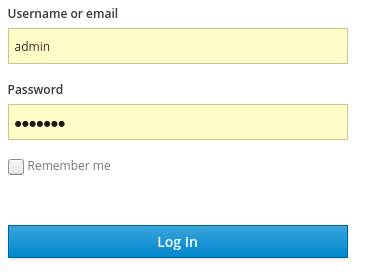
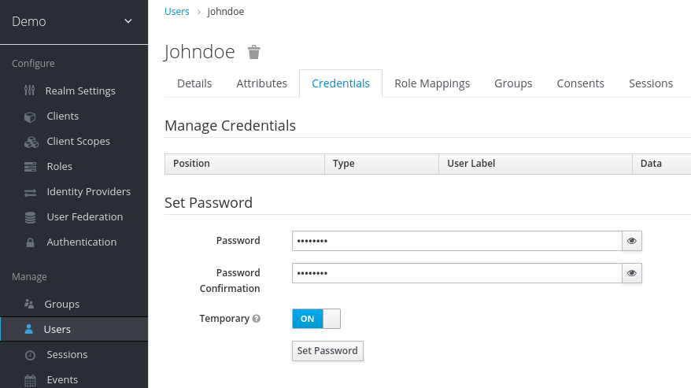
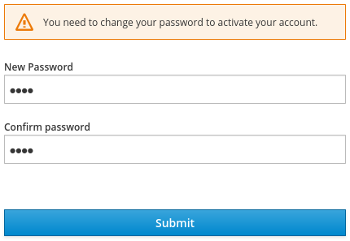
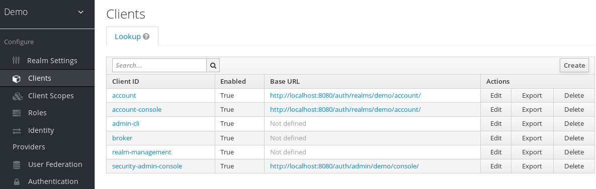
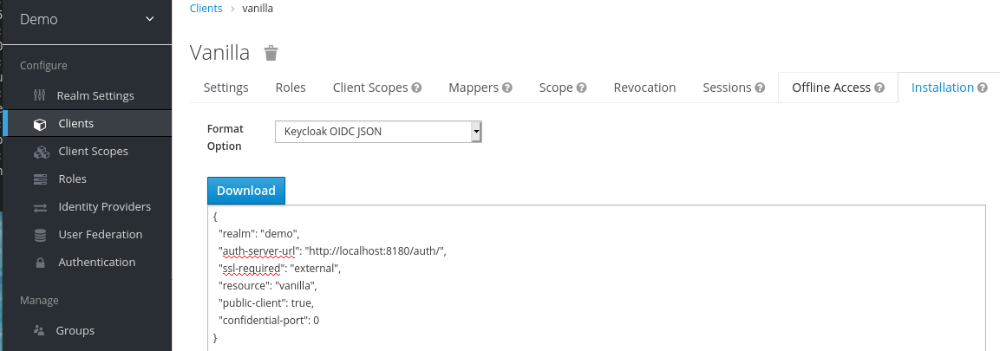
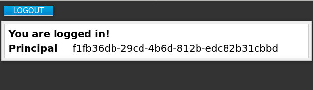

Title: Pratciando com Keycloack

# Praticando com Keycloack

Este guia ajuda você a praticar usando o Keycloak para avaliá-lo antes de usá-lo
em um ambiente de produção. Ele inclui instruções para instalar o servidor
Keycloak no modo autônomo, criar contas e reinos para gerenciar usuários e
aplicativos e proteger um aplicativo de servidor WildFly.

Instalando uma instância de amostra de Keycloak

Esta seção descreve como instalar e iniciar um servidor Keycloak no modo
autônomo, configurar o usuário de administração inicial e fazer login no Console
administrativo Keycloak.

Instalação do Servidor

Você pode instalar o servidor no Linux ou Windows. O arquivo ZIP de download do
servidor contém os scripts e binários para executar o servidor Keycloak.

procedimento

1.  Baixe **keycloak-15.0.0.0.[ zip\|tar.gz]** de [keycloak
    downloads](https://www.keycloak.org/downloads.html).

2.  Coloque o arquivo em um diretório escolhido.

3.  Desempacotar o arquivo ZIP usando o utilitário descompacto apropriado, como
    descompactar, alcatrão ou expandir-arquivo.

>   Linux/Unix

>   \$ unzip keycloak-15.0.0.zip

>   ou

>   \$leva -xvzf keycloak-15.0.0.tar.gz

>   Windows

>   \> expand-archive -Path 'C:Downloads\\keycloak-15.0.0.zip' -DestinationPath
>   'C:\\Downloads'

Iniciando o servidor Keycloak

Você inicia o servidor no sistema onde o instalou.

Pré-requisitos

-   Você não viu erros durante a instalação do servidor Keycloak.

procedimento

1.  Vá para o diretório de bin da distribuição do servidor.

2.  Execute o script de inicialização autônomo.

>   Linux/Unix

>   Caixa de CD \$

>   \$ ./standalone.sh

>   Windows

>   \> ...\\bin\\autônomo.bat

Criando a conta de administração

Antes de usar o Keycloak, você precisa criar uma conta de administração que você
usa para fazer login no console administrador Keycloak.

Pré-requisitos

-   Você não viu erros quando começou o servidor Keycloak.

procedimento

1.  Abra <http://localhost:8080/auth> no seu navegador.

>   A página de boas-vindas é aberta, confirmando que o servidor está em
>   execução.

>   Página de boas-vindas

>   Página de boas-vindas

1.  Digite um nome de usuário e senha para criar um usuário administrador
    inicial.

Login no console administrativo

Depois de criar a conta de administração inicial, você pode fazer login no
console administrativo. Neste console, você adiciona usuários e registra
aplicativos a serem protegidos pelo Keycloak.

Pré-requisitos

-   Você tem uma conta de administração para o console administrativo.

procedimento

1.  Clique no link **Do Console de Administração** na página **Bem-vindo** ou vá
    diretamente para <http://localhost:8080/auth/admin/> (a URL do console).

|   | O Console de Administração é geralmente referido como o console administrativo para abreviar a documentação keycloak. |
|---|-----------------------------------------------------------------------------------------------------------------------|

2.  Digite o nome de usuário e senha que você criou na página **Welcome** para
    abrir o console **administrativo**.

>   Tela de login do console administrador

>   Tela de login do console administrador

>   A tela inicial do console administrativo aparece.

>   Console administrativo

>   Console administrativo

Próximos passos

Agora que você pode entrar no console administrativo, você pode começar a criar
reinos onde os administradores podem criar usuários e dar-lhes acesso aos
aplicativos. Para obter mais detalhes, consulte [Criando um reino e um
usuário](https://www.keycloak.org/docs/latest/getting_started/index.html#creating-first-realm_).

Criando um reino e um usuário

O primeiro uso do console administrador Keycloak é criar um reino e criar um
usuário nesse reino. Você usa esse usuário para fazer login no seu novo reino e
visitar o console de conta incorporada, ao qual todos os usuários têm acesso.

Reinos e usuários

Quando você faz login no console administrativo, você trabalha em um reino, que
é um espaço onde você gerencia objetos. Existem dois tipos de reinos:

-   Domínio- Este reino foi criado para você quando você começou Keycloak. Ele
    contém a conta de administração que você criou no primeiro login. Você usa
    este reino apenas para criar outros reinos.

-   Outros reinos - Esses reinos são criados pelo administrador no reino mestre.
    Nesses domínios, os administradores criam usuários e aplicativos. Os
    aplicativos são de propriedade dos usuários.

Criando um reino

Como administrador no domínio mestre, você cria os reinos onde os
administradores criam usuários e aplicativos.

Pré-requisitos

-   Keycloak está instalado.

-   Você tem a conta de administração inicial para o console administrativo.

procedimento

1.  Vá para <http://localhost:8080/auth/admin/> e faça login no console
    administrativo Keycloak usando a conta de administração.

2.  No menu **Mestre,** clique em **Adicionar Reino**. Quando você está logado
    no domínio mestre, este menu lista todos os outros reinos.

3.  Digite demonstração no campo **Nome.**

>   Um novo reino

>   Um novo reino

|   | O nome do reino é sensível ao caso, então anote o caso que você usa. |
|---|----------------------------------------------------------------------|

1.  Clique em **Criar**.

>   A página principal do console administrativo é aberta com o reino definido
>   como demo.

>   Reino demo

>   Reino demo

1.  Alternar entre gerenciar o reino mestre e o reino que você acabou de criar
    clicando em entradas na lista de drop-down do **Reino Seleto.**

Criando um usuário

No domínio demo, você cria um novo usuário e uma senha temporária para esse novo
usuário.

procedimento

1.  No menu, clique **em Usuários** para abrir a página da lista de usuários.

2.  No lado direito da lista de usuários vazia, clique em **Adicionar usuário**
    para abrir a página Adicionar usuário.

3.  Digite um nome no campo Nome de usuário.

>   Este é o único campo necessário.

>   Adicionar página do usuário

>   Adicionar página do usuário

1.  Vire o interruptor **verificado por e-mail** para Ligar e clique em
    **Salvar**.

>   A página de gerenciamento do novo usuário é aberta.

1.  Clique na guia **Credenciais** para definir uma senha temporária para o novo
    usuário.

2.  Digite uma nova senha e confirme-a.

3.  Clique **em Definir senha** para definir a senha de usuário para a nova que
    você especificou.

>   Gerenciar credenciais

>   Gerenciar credenciais

|   | Esta senha é temporária e o usuário será obrigado a alterá-la no primeiro login. Se preferir criar uma senha persistente, gire o interruptor **temporário** para **desligar** e clique em Definir **senha**. |
|---|--------------------------------------------------------------------------------------------------------------------------------------------------------------------------------------------------------------|

Login no console da conta

Todo usuário em um reino tem acesso ao console da conta. Você usa este console
para atualizar as informações do seu perfil e alterar suas credenciais. Agora
você pode testar o login com esse usuário no reino que você criou.

procedimento

1.  Saia do console administrativo abrindo o menu do usuário e selecionando
    **Sign Out**.

2.  Vá para <http://localhost:8080/auth/realms/demo/account> e faça login no seu
    domínio de demonstração como o usuário que você acabou de criar.

3.  Quando você for solicitado a fornecer uma nova senha, digite uma senha que
    você possa lembrar.

>   Atualizar senha

>   Atualizar senha

>   O console da conta é aberto para este usuário.

>   Console de conta

>   console conta

1.  Preencha os campos necessários com quaisquer valores para testar usando esta
    página.

Próximos passos

Agora você está pronto para o procedimento final, que é garantir uma aplicação
de amostra que é executada no WildFly. Consulte [A garantia de uma aplicação de
amostra](https://www.keycloak.org/docs/latest/getting_started/index.html#securing-sample-app_).

Protegendo uma aplicação de amostra

Agora que você tem uma conta de administração, um reino e um usuário, você pode
usar o Keycloak para garantir um aplicativo de servlet WildFly. Você instala um
adaptador cliente WildFly, registra o aplicativo no console administrativo,
modifica a instância WildFly para trabalhar com o Keycloak e usa o Keycloak com
algum código de amostra para proteger o aplicativo.

Pré-requisitos

-   Você precisa ajustar a porta usada pela Keycloak para evitar conflitos
    portuários com o WildFly.

Ajuste da porta usada por Keycloak

As instruções contidas neste guia aplicam-se à execução do WildFly na mesma
máquina do servidor Keycloak. Nesta situação, mesmo que o WildFly esteja
empacotado com o Keycloak, você não pode usar o WildFly como um contêiner de
aplicação. Você deve executar uma exemplo wildfly separada para o seu aplicativo
servlet.

Para evitar conflitos portuários, você precisa de portas diferentes para
executar Keycloak e WildFly.

Pré-requisitos

-   Você tem uma conta de administração para o console administrativo.

-   Você criou um reino demo.

-   Você criou um usuário no reino demo.

procedimento

1.  Baixe WildFly [de WildFly.org](https://www.wildfly.org/).

2.  Descompactar o WildFly baixado.

>   \$ unzip \<filename\>.zip

1.  Mude para o diretório raiz keycloak.

2.  Inicie o servidor Keycloak fornecendo um valor para a propriedade do sistema
    jboss.socket.binding.port-offset. Esse valor é adicionado ao valor base de
    cada porta aberta pelo servidor Keycloak. Neste exemplo, **100** é o valor.

>   Linux/Unix

>   Caixa de CD \$

>   \$ ./standalone.sh -Djboss.socket.binding.port-offset=100

>   Windows

>   \> ...\\bin\\autônomo.bat -Djboss.socket.binding.port-offset=100

>   Windows Powershell

>   \> ...\\bin\\autônomo.bat -D"jboss.socket.binding.port-offset=100"

1.  Confirme se o servidor Keycloak está em execução. Vá para
    [http://localhost:8180/auth/admin/.](http://localhost:8180/auth/admin/)

>   Se o console administrativo abrir, você está pronto para instalar um
>   adaptador cliente que permite que o WildFly trabalhe com o Keycloak.

Instalando o adaptador cliente WildFly

Quando WildFly e Keycloak são instalados na mesma máquina, WildFly requer alguma
modificação. Para fazer essa modificação, você instala um adaptador cliente
Keycloak.

Pré-requisitos

-   O WildFly está instalado.

-   Você tem um backup do .. /autônomo/configuração/autônomo.xml arquivo se você
    tiver personalizado este arquivo.

procedimento

1.  Baixe a distribuição **wildfly openid connect client adapter** [de
    keycloak.org](https://www.keycloak.org/downloads.html).

2.  Mude para o diretório raiz do WildFly.

3.  Descompacte o adaptador de cliente baixado neste diretório. por exemplo:

>   \$ unzip \<filename\>.zip

1.  Mude para o diretório bin.

>   Caixa de CD \$

1.  Execute o script apropriado para sua plataforma.

|   | Se você receber um arquivo não encontrado,certifique-se de que você usou descompactar na etapa anterior. Este método de extração instala os arquivos no lugar certo. |
|---|----------------------------------------------------------------------------------------------------------------------------------------------------------------------|

2.  WildFly 10 no Linux/Unix

3.  \$ ./jboss-cli.sh --file=adaptador-instalar-offline.cli

4.  WildFly 10 no Windows

5.  \> jboss-cli.bat --file=adaptador-instalar-offline.cli

6.  Wildfly 11 no Linux/Unix

7.  \$ ./jboss-cli.sh --file=adaptador-elytron-install-offline.cli

8.  Wildfly 11 no Windows

9.  \> jboss-cli.bat --file=adaptador-elytron-install-offline.cli

|   | Este script faz as edições necessárias para o ... /autônomo/configuração/autônomo.xml arquivo. |
|---|------------------------------------------------------------------------------------------------|

10. Inicie o servidor de aplicativos.

>   Linux/Unix

>   \$ ./standalone.sh

>   Windows

>   \> ...autônomo.bat

Registrando o aplicativo WildFly

Agora você pode definir e registrar o cliente no console administrador Keycloak.

Pré-requisitos

-   Você instalou um adaptador de cliente para trabalhar com o WildFly.

procedimento

1.  Faça login no console administrativo com sua conta administrativa:
    <http://localhost:8180/auth/admin/>

2.  Na lista de drop-down superior esquerdo, selecione o reino de Demonstração.

3.  Clique em Clientes no menu lateral esquerdo para abrir a página Clientes.

>   Clientes

>   Clientes

1.  No lado direito, clique em **Criar**.

2.  Na caixa de diálogo Adicionar cliente, crie um cliente chamado **baunilha**
    completando os campos como mostrado abaixo:

>   Adicionar cliente

>   Adicionar cliente

1.  Clique **em Salvar**.

2.  Na página do cliente **Baunilha** que aparece, clique na guia
    **Instalação.**

3.  Selecione **Keycloak OIDC JSON** para gerar um arquivo que você precisa em
    um procedimento posterior.

>   Arquivo Keycloak.json

>   Arquivo Keycloak.json

1.  Clique **em Baixar** para salvar **Keycloak.json** em um local que você pode
    encontrar mais tarde.

2.  Selecione **Keycloak OIDC JBoss Subsystem XML** para gerar um modelo XML.

>   Modelo XML

>   Modelo XML

1.  Clique em **Baixar** para salvar uma cópia para uso no próximo procedimento,
    que envolve a configuração WildFly.

Modificando a instância WildFly

O aplicativo servlet WildFly requer configuração adicional antes de ser
protegido pelo Keycloak.

Pré-requisitos

-   Você criou um cliente chamado **Baunilha** no **reino demo.**

-   Você salvou um arquivo XML de modelo para este cliente.

procedimento

1.  Vá para o diretório autônomo/de configuração em seu diretório raiz WildFly.

2.  Abra o arquivo autônomo.xml e pesquise o seguinte texto:

>   \<subssistema xmlns="urna:jboss:domínio:keycloak:1.1"/\>

1.  Altere a entrada XML do auto-fechamento para o uso de um par de tags de
    abertura e fechamento, como mostrado aqui:

2.  \<subssistema xmlns="urna:jboss:domínio:keycloak:1.1"\>

>   \</subsistema\>

1.  Cole o conteúdo do modelo XML dentro do \<subsubsistema\>element, como
    mostrado neste exemplo:

2.  \<subssistema xmlns="urna:jboss:domínio:keycloak:1.1"\>

3.  nome de implantaçãode \<secura="NOME DO MÓDULO DE GUERRA.guerra"\>

4.  \<realm\>demo\</reino\>

5.  \<auth-server-url\>http://localhost:8180/auth\</auth-server-url\>

6.  \<public-client\>true\</public-client\>

7.  \<ssl-required\>EXTERNAL\</ssl-required\>

8.  \<resource\>\</resource\>

9.  \</implantação segura\>

>   \</subsistema\>

1.  Alterar O NOME DO MÓDULO DE GUERRA.guerra para baunilha.guerra:

2.  \<subssistema xmlns="urna:jboss:domínio:keycloak:1.1"\>

3.  \<secução de nome="baunilha.guerra"\>

4.  ...

>   \</subsistema\>

1.  Reinicie o servidor de aplicativos.

Instalando código de amostra para proteger o aplicativo

O procedimento final é tornar este aplicativo seguro instalando algum código de
amostra do repositório https://github.com/keycloak/keycloak-quickstarts. Os
quickstarts funcionam com o lançamento mais recente de Keycloak.

O código de amostra é o **app-profile-jee-vanilla** quickstart. Ele demonstra
como alterar um aplicativo JavaEE que é protegido com autenticação básica sem
alterar o WAR. O subsistema adaptador do cliente Keycloak altera o método de
autenticação e injeta a configuração.

Pré-requisitos

Você tem o seguinte instalado em sua máquina e disponível em seu PATH.

-   Java JDK 8

-   Apache Maven 3.1.1 ou superior

-   Git

Você tem um arquivo **keycloak.json.**

procedimento

1.  Certifique-se de que o servidor de aplicativos WildFly está iniciado.

2.  Baixe o código e altere diretórios usando os seguintes comandos.

3.  \$ git clone https://github.com/keycloak/keycloak-quickstarts

>   \$ cd keycloak-quickstarts/app-profile-jee-vanilla/config

1.  Copie o arquivo keycloak.json para o diretório atual.

2.  Mova um nível para o diretório de perfil-jee-baunilha do aplicativo.

3.  Instale o código usando o seguinte comando.

>   \$ mvn clean wildfly:deploy

1.  Confirme se a instalação do aplicativo foi bem sucedida. Vá para
    <http://localhost:8080/vanilla> onde uma página de login é exibida.

>   Página de login confirmando o sucesso

>   Página de login confirmando o sucesso

1.  Faça login usando a conta que você criou no reino demo.

>   Página de login para demo realm

>   Página de login para demo realm

>   Uma mensagem aparece indicando que você completou um uso bem-sucedido do
>   Keycloak para proteger um aplicativo WildFly de amostra. parabéns!

>   Sucesso completo

>   Sucesso completo
